# Welcome to manual page of F1/10!
{:.no_toc}

This site will be the future place of reference for F1/10 race cars! But it is a work in progress for now, so place refer to [Car Assembly Page](http://f1tenth.org/car-assembly) to look at the pdf manual


# Table of Contents
{:.no_toc}
1. The generated Toc will be an ordered list
{:toc}

---

## What you need to start

### Miscellaneous
(1) Laptop with Ubuntu Xenial 16.04.01 LTS installed. (Other versions of Ubuntu may work as well, but we can’t guarantee this.)

### The hardware kit
#### Mechanical
(1) Traxxas RC rally car (recommended model: Ford Fiesta ST)<br/>
Note: as of August 2018, this car is sold with a brushed motor by Traxxas. See link below for brushless motor.
(1) [Velineon 3351R/3500 brushless DC motor](​https://www.amazon.com/Traxxas-Velineon-Brushless-Motor-3500Kv/dp/B00XWTXOCC/ref=sr_1_5?s=toys-and-games&ie=UTF8&qid=1533078584&sr=1-5&keywords=3351r&dpID=412p2cEdtOL&preST=_SX342_QL70_&dpSrc=srch)<br/>
(1) laser-cut chassis on which you will mount everything<br/>
(1) LIDAR mount with (2) C-shaped brackets<br/>
(2) threaded 14mm M3 standoffs<br/>
(4) 19mm M3 standoffs<br/>
(8) 35mm M3 standoffs<br/>
(4) 45mm M3 standoffs<br/>
(35) 10mm M3 screws<br/>
(4) 20mm M3 screws<br/>
(4) 8mm round nylon spacers<br/>
(1) Roll of double-sided tape (for mounting USB hubs and optionally FOCbox)<br/>

[Back to Top](#table-of-contents)

#### Electrical
(1) power board (obtained from University of Pennsylvania team. This was designed at Penn, printed by ​ www.4pcb.com​ )<br/>
(1) Nvidia Jetson TX1 or TX2 with Wi-Fi antennas (included with the development board)<br/>
(1) Orbitty carrier board (for Jetson)<br/>
(1) Hokuyo 10LX or 30LX LIDAR<br/>
(1) Traxxas LiPo or NiMH battery (at least 9V)<br/>
(1) FOCbox or VESC 4.12 electronic speed controller<br/>
(1) USB hub (at least 6 ports)<br/>
(1) short (~1 ft) USB micro cable<br/>
(2) spools/strips of 22 AWG wire of different colors (preferably red and black)<br/>
(1) USB keyboard and mouse<br/>
(1) HDMI display<br/>
Optional: (1) HDMI dummy plug and (1) USB Wi-Fi adapter for connecting to the car via VNC
[Back to Top](#table-of-contents)

#### Tools
(1) Metric ruler<br/>
(1) Needle-nose pliers<br/>
(1) Wire strippers<br/>
(1) 2mm width or smaller flathead screwdriver<br/>
(1) 5/64 inch diameter hex driver key or small Phillips screwdriver (1) Hex socket driver or wrench (to hold standoffs in place)<br/>
(1) T3 Torx screwdriver<br/>
[Back to Top](#table-of-contents)


## Preparing and Assembling the Car


### Preparing the Car 

TODO: will fill out when the fourth Traxxas car arrives<br/>

Obtaining the Power Board<br/>
[1. Instructions on getting the power board from Penn,
2. and a link to files that you would send to a PCB company like 4PCB or PCBWay. Currently on github ​https://github.com/mlab-upenn/f1tenth-dev/tree/master/power-board-v2.0​ ]<br/>
 
A note on why we have a power board:​ The power board is used to provide a stable voltage source for the car and its peripherals since the battery voltage drops as the battery runs out. The board does not do any charging of the battery, so you will need a Traxxas EZ-Peak charger to charge it (you can find them on Traxxas' website). At present, there's no way to know the battery's charge level except by measuring it with a multimeter or the BLDC Tool as it runs, but we could think about adding a low voltage LED or seven-segment LCD display (to show the voltage) to the next iteration of the board. The LIPO protection module and green connectors are currently unused and are a legacy from previous F1/10 car iterations which used the Teensy microcontroller as a motor driver.<br/>
[Back to Top](#table-of-contents)


### Installing the Body Standoffs

Begin by installing four 45mm M3 standoffs into the holes of the main car body pictured below. Secure the standoffs to the bottom of the car using 10mm M3 screws, and use either nosepliers or a hex driver to hold the standoff in place while you turn the screw on the other side. Pay attention to where you install the standoffs since there are several mounting holes on the car's base. See the picture below for clarification.<br/>

Next, install two threaded 14mm M3 standoffs into the front holes in the car base, using the pliers or hex driver to thread the standoffs into the holes. Don't mount the chassis to the car yet since we still need to mount the Jetson and power board to the chassis.<br/>

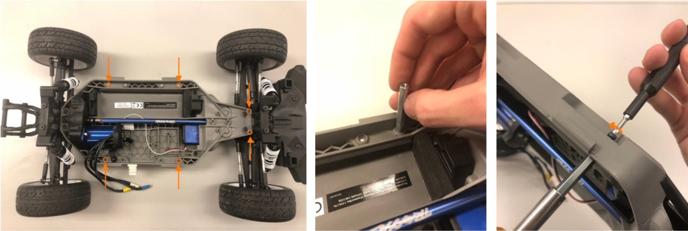

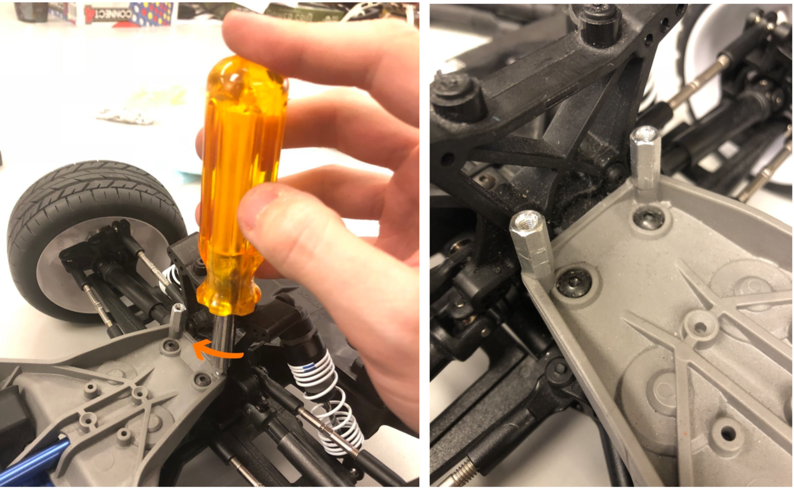
[Back to Top](#table-of-contents)


### Mounting the FOCbox to the Chassis
Feed the three motor wires for the FOCbox through the rectangular slot in the chassis as shown below.

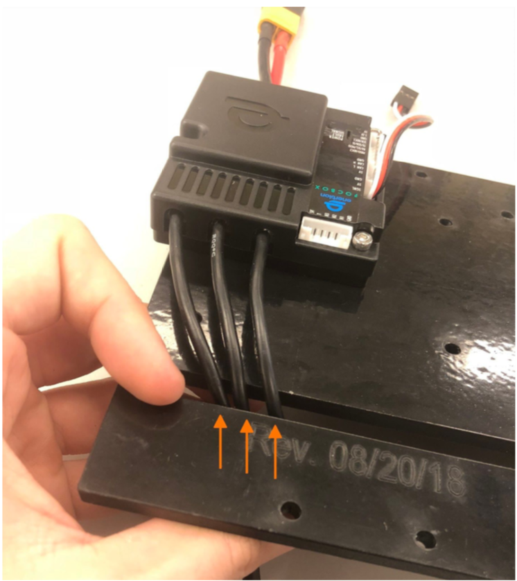

Alternate method of securing the FOCbox if screws don’t fit​ : Some FOCboxes (the more recently-made ones) have smaller screw holes that won’t fit M3-size screws. If this is the case for your FOCbox, you can use a few pieces of double-sided tape to secure the FOCbox instead.<br/>

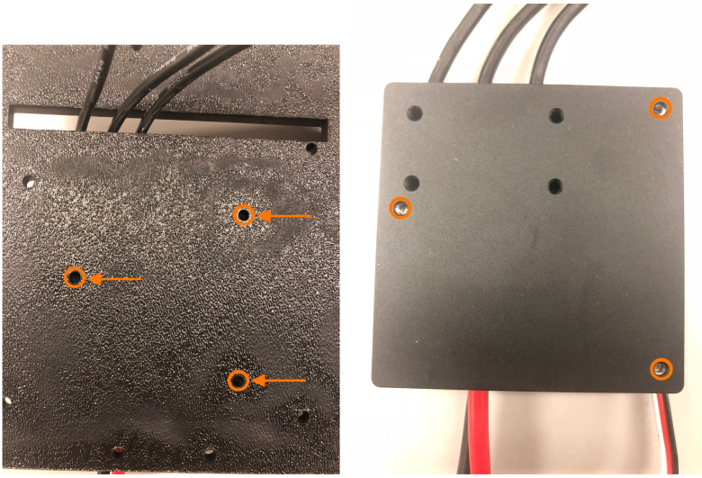

[Back to Top](#table-of-contents)

### Installing the Chassis Standoffs
Mount eight 35mm M3 standoffs to the ​ glossy side​ of the black laser-cut chassis in the
positions shown below. Thread 10mm M3 screws through the drill holes and screw
them into the standoffs to secure them. (​ Important​ : If you do not mount the standoffs to
the glossy side, the power board won't fit since the screw holes will be misaligned.) <br/>

Note there are several drill holes in the chassis, so make sure you’re using the right
ones. In the image below, the 4 screws on the left(which is the back of the car) will
eventually hold the power board, so that’s a good way to see if they’re properly placed.
The 4 screws on the right (2 on each side of the oval cutout) will eventually hold the
Orbitty carrier attached to the Jetson.<br/>

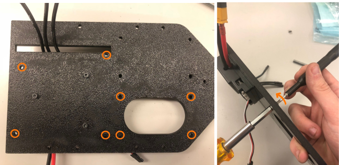

Mount two more (19mm M3) standoffs to the front part of the chassis for the LIDAR, and
secure with 10mm screws. The top part of the chassis should look like the picture
below.

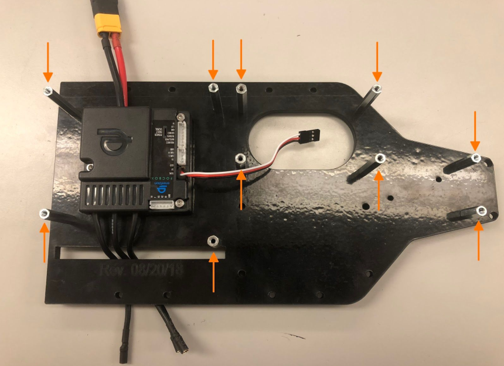

[Back to Top](#table-of-contents)


### Detaching the Jetson from the Development Board
When you purchase a Jetson, it is attached to a development board. In order to use it
on the car, you will need to unscrew the Jetson and its Wi-Fi antenna from the
development board.<br/>
Before you remove the antenna, you will need to remove the bottom plate from the
development board. Remove the four screws marked below and lift the development
board away from the plate.<br/>

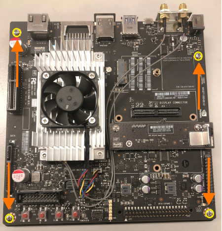

Next, remove the Wi-Fi antenna by unscrewing the two screws marked below. Keep the
screws in a safe place, as you’ll use them in a bit to attach the antennas to standoffs. <br/>

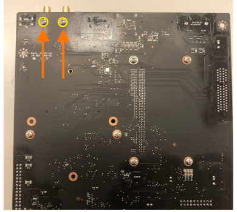

Remove the two brass-colored nuts holding the antennas to the L-shaped bracket, and
then remove the two antennas from the bracket. It helps to use two pairs of pliers: one
to hold the rear nuts in place and another to unscrew the nuts on the end with the
antenna connectors.<br/>

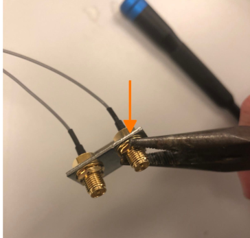

Using a Phillips screwdriver, thread the two screws you saved earlier completely into
the bracket as pictured below. Attach two standoffs to the opposite ends of the screws
and hand-tighten them until they won’t turn anymore. Use the pliers to tighten the
standoffs more while you hold the head of the screw in place using the screwdriver.
Once you’ve done these steps, place the antennas and washers back into the bracket,
and tighten the brass nuts onto the threaded connectors again.<br/>

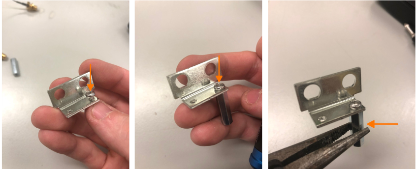

Unplug the Jetson’s fan and remove the Jetson from the development board by using a
T3 Torx screwdriver to unscrew the Jetson (the large silver heat sink), and then pull up
gently to detach it from the development board. Keep the Jetson in a safe place while
you attach the antennas to the power board.<br/>

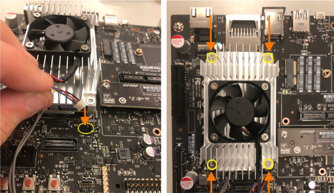
[Back to Top](#table-of-contents)


### Mounting the Wi-Fi Antennas to the Power Board
Attach the two standoffs for the Wi-Fi antenna bracket to the power board, making sure
the antennas, when installed and extended, lie ​ over ​ the board and now away from it.
Install the two black antennas onto the threaded connectors if they aren’t already on.<br/>

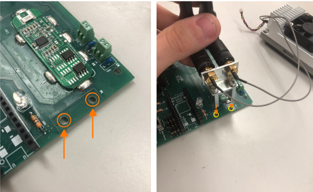

Attach the two wires for the Jetson Wi-Fi antenna to the two gold-colored connectors
near the fan connector on the heat sink (the order of the wires doesn’t matter). This can
be a little tricky, so you might want to use a flathead screwdriver to ensure the
connections are tight. ​ Don’t press too hard​ , however as you can easily damage the
connectors if you use excessive force!

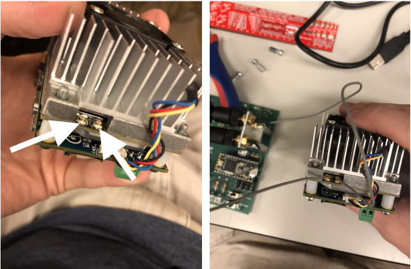
[Back to Top](#table-of-contents)

### Mounting the Power Board to the Chassis

Screw the power board onto its chassis standoffs using 10mm M3 screws. The screw
positions are indicated with arrows below.

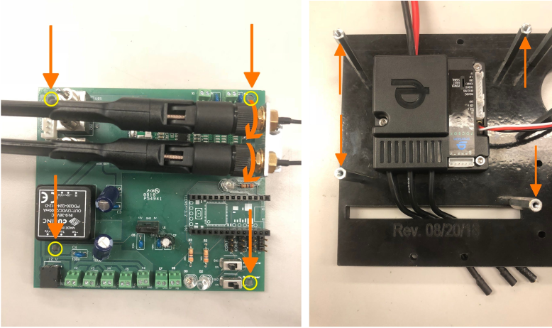

[Back to Top](#table-of-contents)


### Attaching the Orbitty to the Jetson
Attach the Orbitty to the Jetson by connecting the two long black ports and connect the Jetson’s
fan to the Orbitty’s fan connector as shown in the pictures below..

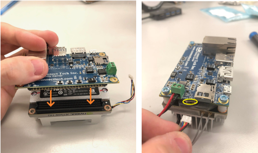
[Back to Top](#table-of-contents)


### Connecting the Jetson and Power Board
Cut two 8-inch pieces of wire of different colors (preferably red and black), and strip
both ends to a short length (1/8 inch). Locate the green terminal block on the Jetson
and attach one end of one wire to the + ​ Vin​ terminal, and the other end to one of the
green 1 ​ 2V​ terminals on the power board. (Any of the 12 volt terminals are acceptable. To
attach, insert the stripped end into the terminal and screw the little screw tight with a
small flathead screwdriver.) Attach the other stripped wire to the G ​ ND​ terminal on the
Jetson and to the G ​ ND​ terminal on the corresponding terminal block on the power board.

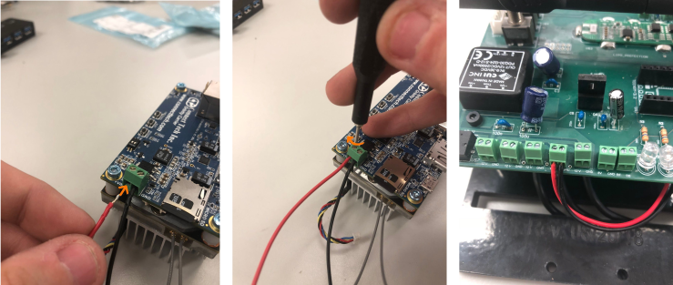

[Back to Top](#table-of-contents)

### Mounting the Jetson to the Chassis
Your kit comes with four white plastic standoffs; place these between the Jetson PCB
and heatsink (see picture) ​ before ​ threading the screws through. Otherwise, you risk
bending the Orbitty while screwing it in. Use 20mm screws to secure the Jetson to its
chassis standoffs.

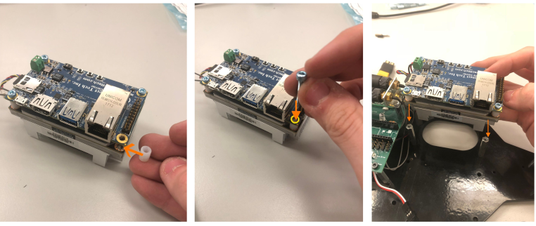

Ensure that when you mount the Jetson that the wires for neither the Wi-Fi antenna nor
the Jetson's power connections get pinched. It might help to tuck both sets of wires
underneath the power board. (Don't tuck them underneath the Jetson because they
might restrict airflow or obstruct the fan's blades.) Your configuration should now look
something like this:

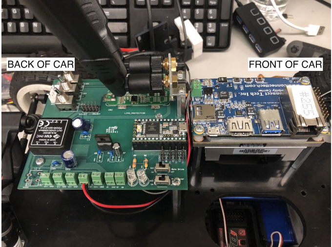


[Back to Top](#table-of-contents)

### Mounting the Chassis to the Car Underbody
Place the chassis onto the five standoffs on the car base and align the chassis’ drill
holes with the car’s base standoffs you attached earlier as shown below. Use six 10mm
M3 screws to secure the chassis to the standoffs.

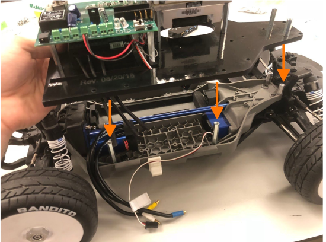
[Back to Top](#table-of-contents)

### Mounting the LIDAR
The LIDAR should have two cords: one for power and another for either Ethernet or
USB. Cut the end of the power cord, leaving 1-2 feet of cable. Strip the end, cut away all
wires except for the blue and brown ones, and strip those two wires to 1/8 inch as
shown below.

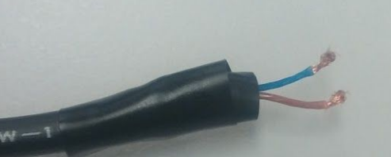

Attach the LIDAR to the tree-shaped base using two (10LX) or four (30LX) screws, such
that the wires protruding from the LIDAR go towards the back of the car. (For the 30LX,
the two LEDs at the top of the LIDAR should face the front of the car.) Then mount the
C-shaped brackets to the black tree-shaped base as shown in the pictures below. ​ Note:
if the black mount does not fit in the holes of the C brackets, sand the inserts until they
do.
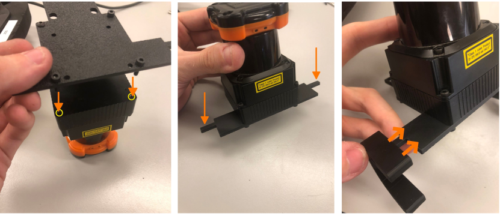

Mount the LIDAR to the car by fitting the two thick protruding parts of the mounting
brackets into the holes. The open part of the "C" in the brackets should face forward as
shown below.
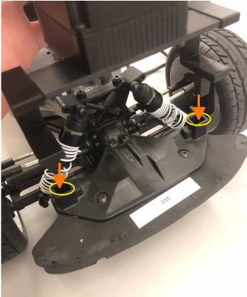

If you completed the previous steps correctly, two of the holes on the narrow end of the
LIDAR base should match up with the two 19mm standoffs you mounted earlier. Wind
the power and USB cords of the LIDAR around its base so that there is just enough
available to plug into the power board and Jetson, with a little bit of slack so that it is not
too tight. Tuck both cords under the LIDAR mounting plate between the two silverstandoffs, and secure the LIDAR base to the standoffs on the chassis using two 10mm
M3 screws.
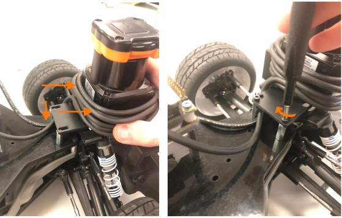
[Back to Top](#table-of-contents)


### Mounting the USB Hubs
Attack two pieces of double-sided tape to a USB hub. Place the hub onto the empty space of
the chassis directly below the Jetson and to the right of the power board as shown. If your hub
has power buttons, make sure all of them are turned on.<br/> 

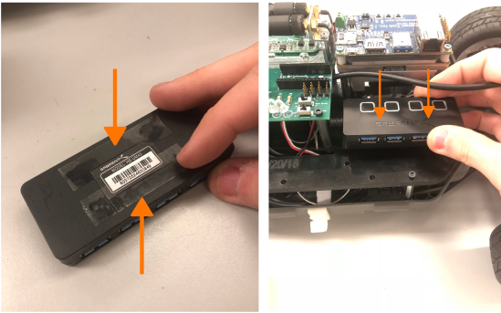

If you need more USB ports (required if your LiDAR uses USB), you can stack a second hub
onto the top of the first. Again, use double-sided tape to secure the second hub and make sure
all power buttons are on.<br/>

Plug the first USB hub into the Orbitty board. If you’re using a second hub, use the white micro
USB adapter that comes with the Jetson to plug in the second hub.

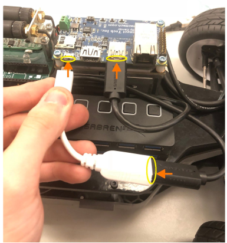


### Connecting the LIDAR

Attach the LIDAR's power cable to a free 12V terminal block on the power board. The brown wire should go to the 12V terminal, and the blue wire should go to the corresponding GND terminal. The side of the LIDAR has a pinout as well if you forget.


If the LIDAR has an Ethernet cable, attach it to the Ethernet port on the Jetson. If it has a USB cable, plug it into the USB hub. Route any excess cables behind the USB hubs as shown. <br/>

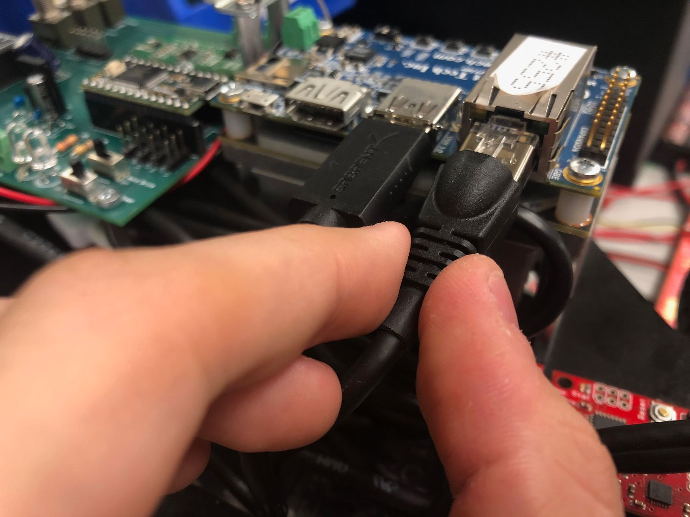


### Connecting the FOCbox

Pass the 3 round FOCbox wires through the rectangular slot in the plastic chassis, then connect the 3 circular bullet connectors to the three motor wires. (The order in which you connect the wires kinda doesn’t matter (electrically speaking). If you run the car and it goes backwards when it should go forwards, you can swap any two of the three wires.) Connect the 3-wire servo ribbon cable as well, making sure the colors match up. <br/>

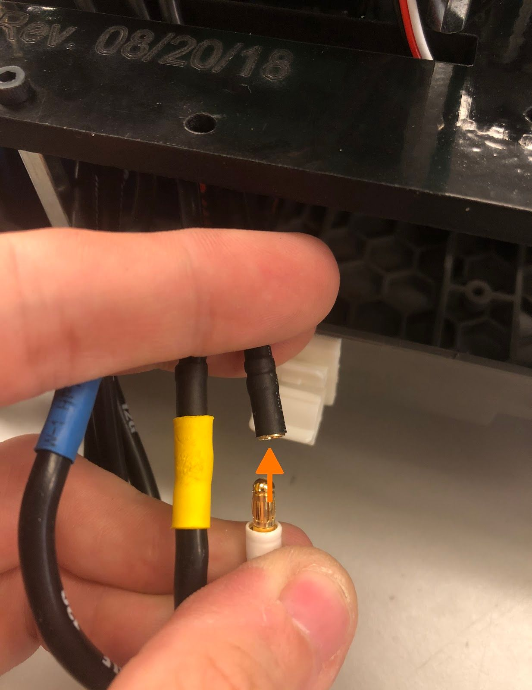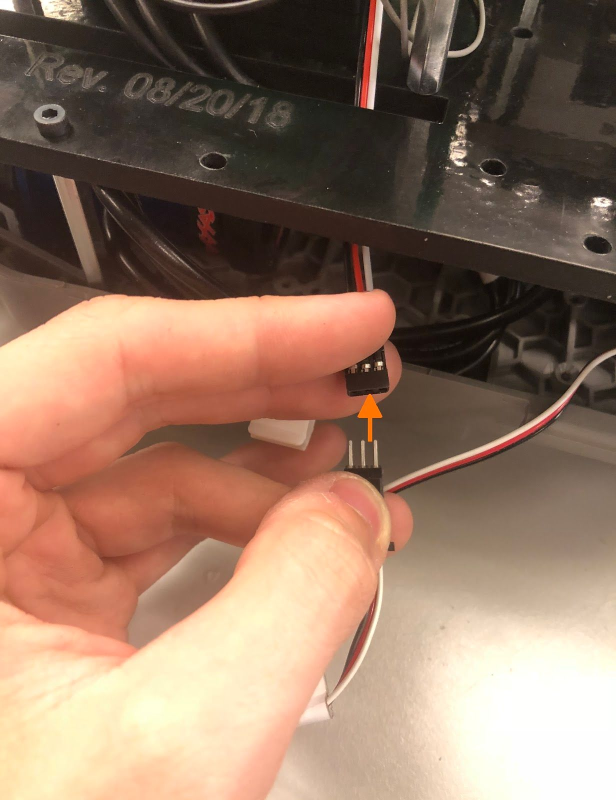

If your micro USB cable is thin enough, thread it through the rectangular wire slot and around the FOCbox to the USB connector as shown below, or route it around the rear end of the chassis if it isn’t. Plug the cable into the FOCbox’s USB connector and into a free port on your USB hub. Tie the USB cable up using a cable tie, and tuck all of the wires underneath the chassis. You can also use this time to plug in the LIDAR (if it is USB), the external Wi-FI adapter, and the receiver for the F710 gamepad.

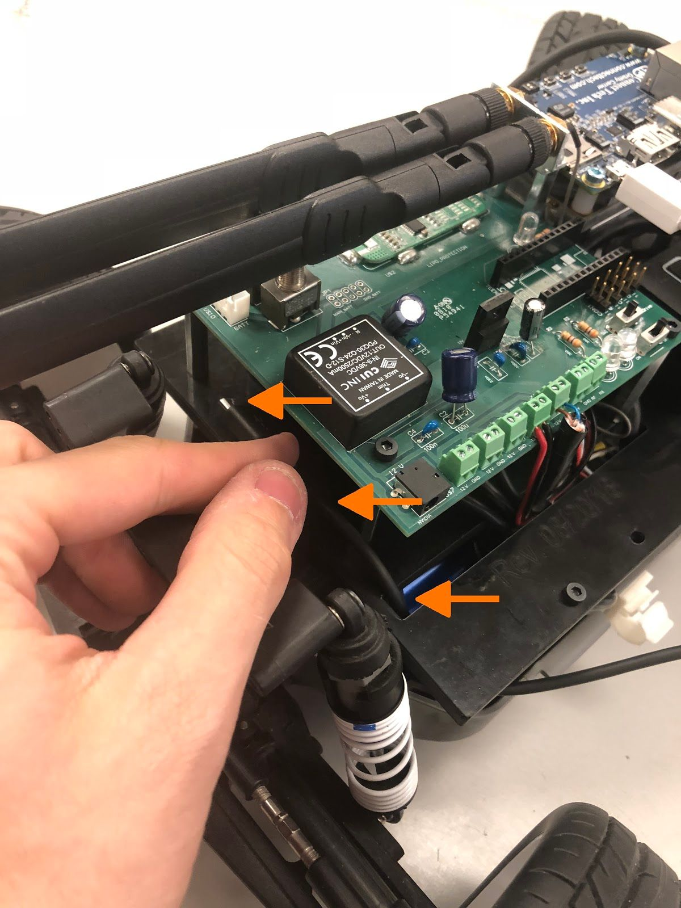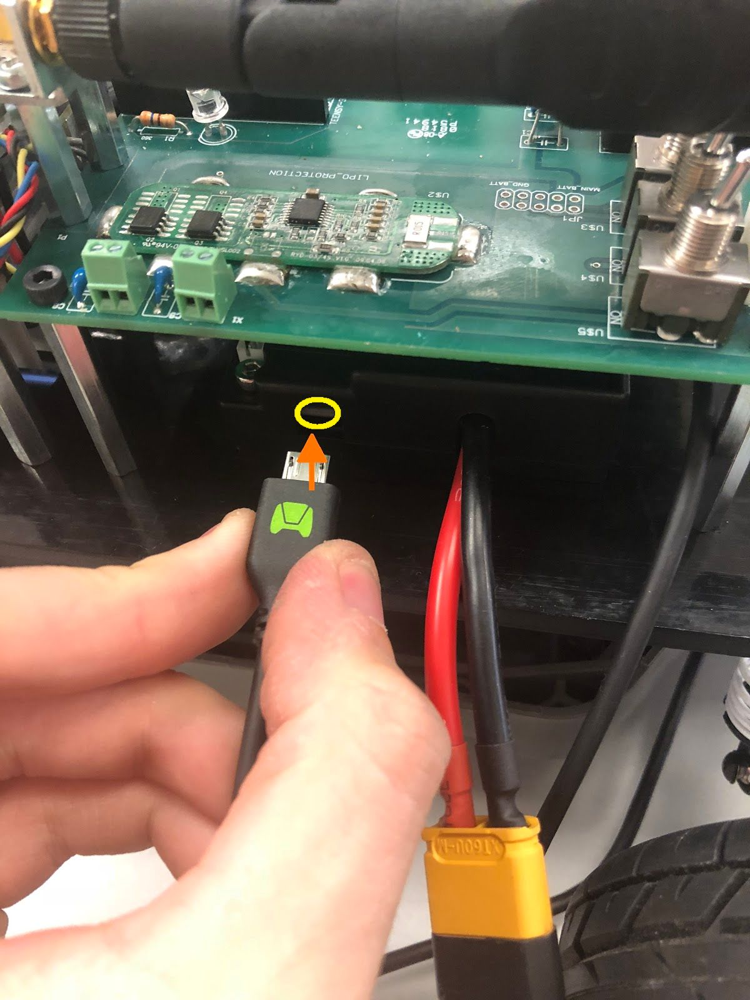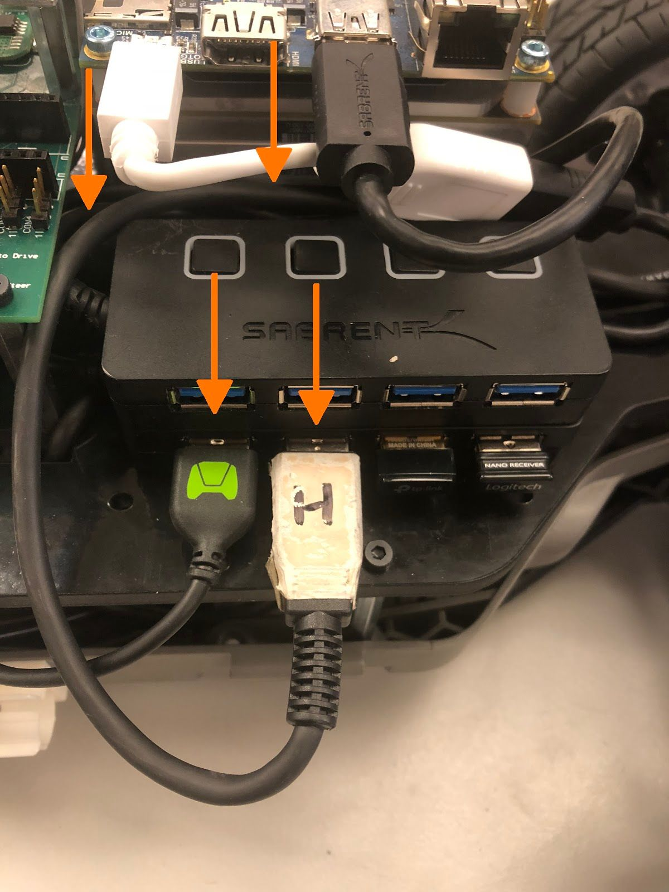


### Connecting the Car to the Battery

Connect the battery to the FOCbox using the battery connector. ​Make sure that red is aligned with red and black is aligned with black - otherwise things will get hot and dicey. ​Then connect the FOCbox to the power board using the white port shown in the picture below. <br/>

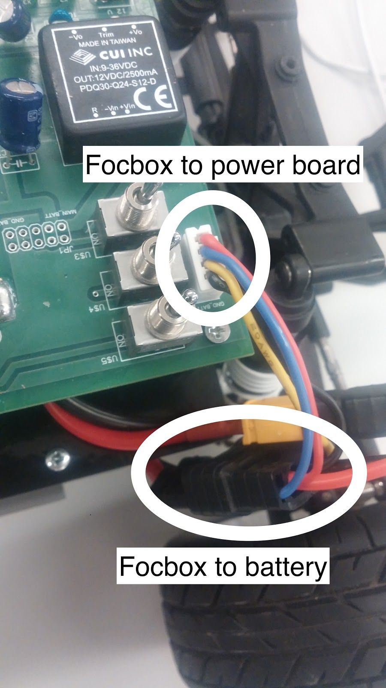

At this point, your car should be assembled, the Jetson lights should flash when you flip the power switch, and the car is ready to run!  <br/>

Note: At present, there's no way to know the battery's charge level except by measuring it with a multimeter as it runs. You might consider adding a low voltage LED or seven-segment LCD display (to show the voltage). <br/>


### Tuning the FOCbox’s PID Gains

In this section we use the words FOCbox and VESC interchangeably.

Important Safety Tips<br/>

- Make sure you hold on to the car while testing the motor to prevent it from flying off the stand. <br/>
- Make sure there are no objects (or people) in the vicinity of the wheels while testing.<br/>
- It’s a good idea to use a fully-charged LiPO battery instead of a power supply to ensure the motor has enough current to spin up.<br/>

1. Put your car on an elevated stand so that its wheels can turn without it going anywhere. If you don’t have an RC car stand, you can use the box that came with your Jetson.<br/>

2. Connect the host laptop to the FOCbox using a USB cable.<br/>

3. Download bldc tool from JetsonHacks (​https://github.com/jetsonhacks/installBLDC​),
following his instructions for installation.<br/>

4. Open BLDC Tool and click the “Connect” button at the top right of the window to connect
to the VESC.
- If you get the error “Device not found”, try running the command ​lsusb​ in a
terminal. You should see an entry for “STMicroelectronics STMF407” or something similar. If you don’t, try unplugging and plugging in the USB cable on both ends. If the problem doesn’t go away, try rebooting the Jetson.<br/>

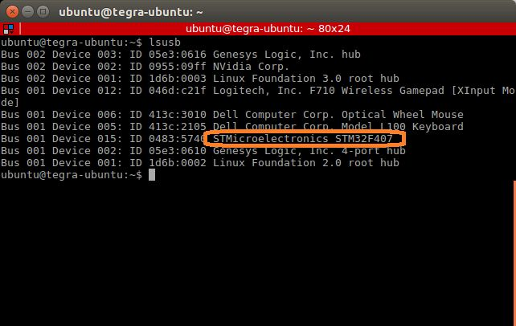

- If you are using a VESC 4.12 (including a FOCbox), ensure the firmware version is 2.18.

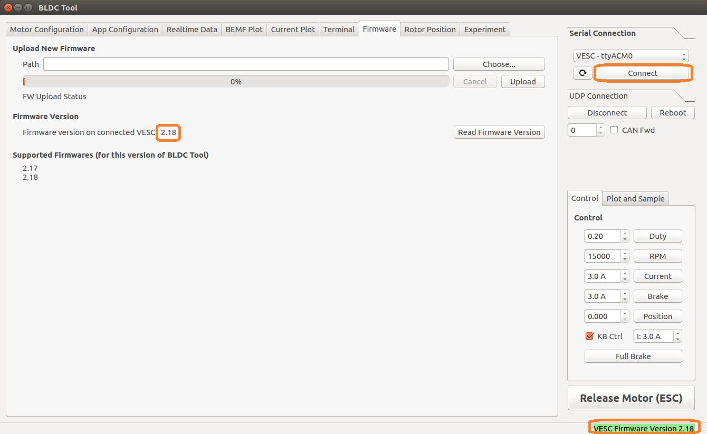

5. Disable keyboard control by clicking the “KB Ctrl” button at the lower right. This will prevent your keyboard’s arrow keys from controlling the motor and is important to prevent damage to the car from it moving unexpectedly.
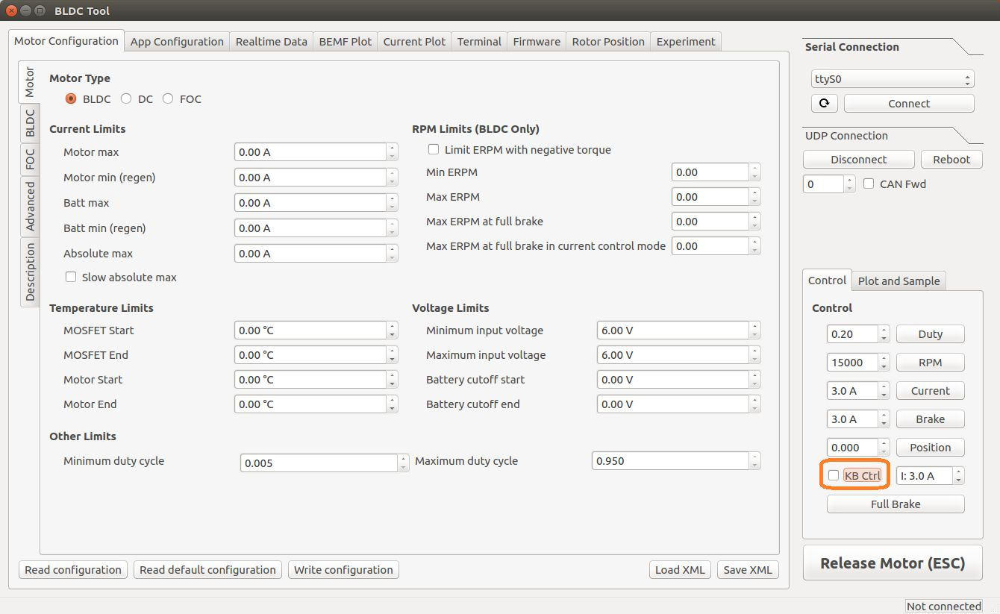

6. Start plotting the realtime RPM data by clicking the “Realtime Data” tab, and checking the “Activate sampling” checkbox at the bottom left of the window. Click the “RPM” tab above the graph.
- We will keep referring to this plot of the motor’s RPM as we tune the PID gains. Out goal is to get the motor to spin up as quickly as possible when we set it to a certain RPM. We also don’t want the motor to cog (not spin) or overshoot the target speed if possible.
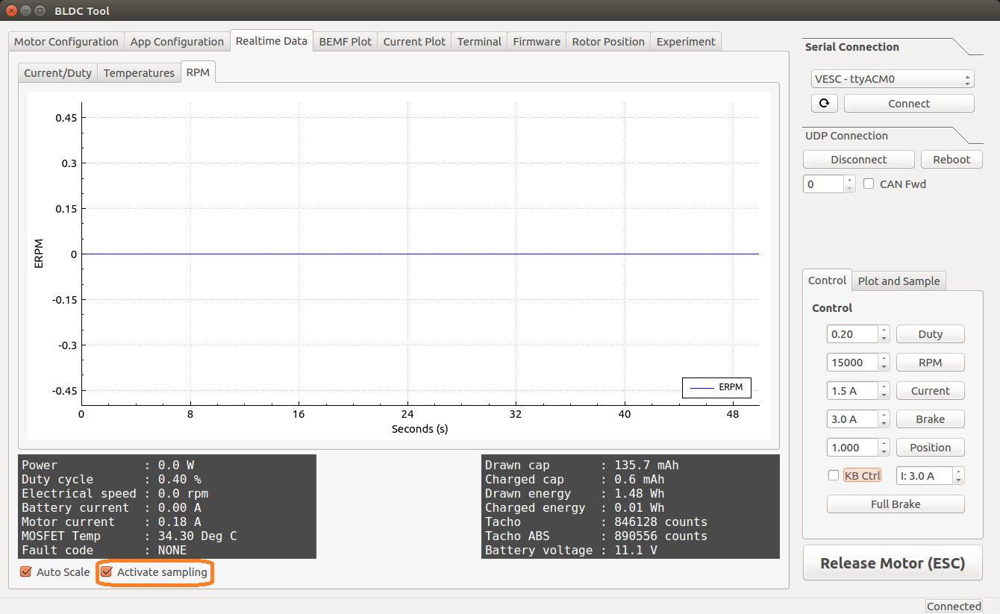

7. Test the motor first (without PID speed control) by setting the “Duty Cycle” to 0.20. This will spin the motor up to approximately 16,000 - 17,000 RPM. Let this run for a few seconds, and then press the “Release Motor” button at the bottom right to stop it.
- Observe the RPM graph. If the motor is spinning backwards (the RPM is negative), try reversing two of the connections from the VESC to the motor. (It doesn’t matter which wires you reverse.)
- If the wheels don’t spin and the motor makes no noise, check to make sure all connections to the motor are tight.
- If the wheels don’t spin and the motor does, ensure the motor’s gear is attached correctly to the gearbox at the back of the car. Spin both front wheels with your hand to verify that the gear is making good contact. You should feel some resistance when turning the wheels.
- If the motor doesn’t spin and makes a humming or hissing sound, you might need to replace the motor. If this doesn’t work, try replacing the VESC.
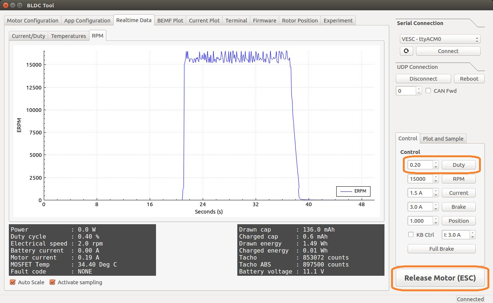

8. Click the “Motor Configuration” tab at the top and the “Advanced” tab on the left. Set Ki and Kd to 0.00000, and set Kp to 0.00001. Click the “Write Configuration” button at the bottom, go back to the data plotting tab and run the car at 3000 RPM.
- You will notice that the car won’t even make it close, as it only goes up to around 1200 RPM. (High steady-state error.)
- Try turning Kp up to 0.00002, 0.00004, and 0.00008. (Don’t forget to write the configuration each time.) The motor will start to cog out at higher Kp values.

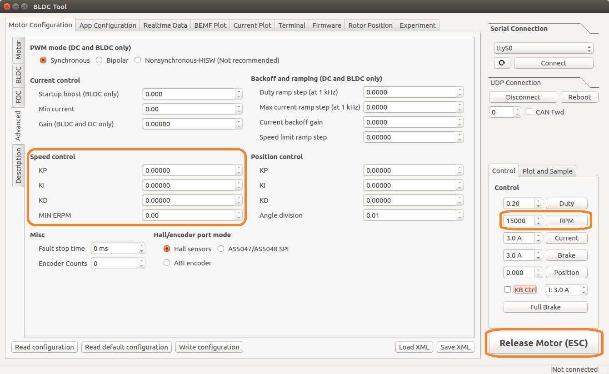

9. Set Kp back to 0.00002, and set Ki to 0.00002, and run the car at 3000 RPM again. Notice how the car slowly reaches the 3000 RPM target. (This is because adding Ki helps to eliminate steady-state error.)
- Keep increasing Ki; set it to 0.00005 and then double that value a few times until the car is able to reach 3000 RPM without overshooting or cogging out.<br/>

10. Now, try increasing the speed to 6000 RPM.<br/>
- The motor might cog out and overshoot. If it does, try halving Kp.<br/>

11. Increase the speed to 10,000 RPM and then 20,000 RPM. ​Make sure you hold the car!
- If the motor cogs out and overshoots, halve Kp until it doesn’t.<br/>
- It may also help to halve Ki if halving Kp doesn’t work.<br/>
- If done correctly, the motor should not overshoot to more than 2 times the set<br/>
RPM. (That is, if the RPM is set to 15,000, its peak value should not exceed 30,000.)


### LiPo (Lithium Polymer) Battery Safety

LiPO batteries allow your car to run for a long time, but they are not something to play with or joke about. They store a large amount of energy in a small space and can damage your car and cause a fire if used improperly. With this in mind, here are some safety tips for using them with the car.<br/>

- When charging batteries, always monitor them and place them in a fireproof bag on a non-flammable surface clear of any other objects.<br/>
- Do not leave a LIPO battery connected to the car when you’re not using it. The battery will discharge and its voltage will drop to a level too low to charge it safely again.<br/>
- Unplug the battery from the car immediately if you notice any popping sounds, bloating of the battery, burning smell, or smoke.<br/>
- Never short the battery leads.<br/>
- Do not plug the battery in backwards. This will damage the VESC and power board (and
likely the Jetson as well) and could cause a short circuit.<br/>

See ​this video​ and ​this video​ for examples of what might happen if you don’t take care of your batteries. Be safe and don’t let these happen to you!<br/>


# Basic software install

## On Your Laptop

### Supported Versions 

You will need to install the OS Ubuntu Xenial 16.04.01 and ROS Kinetic. <b/r>
Could other combinations work? Sure.<b/r>
Will we support them? Nope.<b/r>


## Install ROS

Go to ROS.org and follow the instructions there to install the version of ROS referenced above.

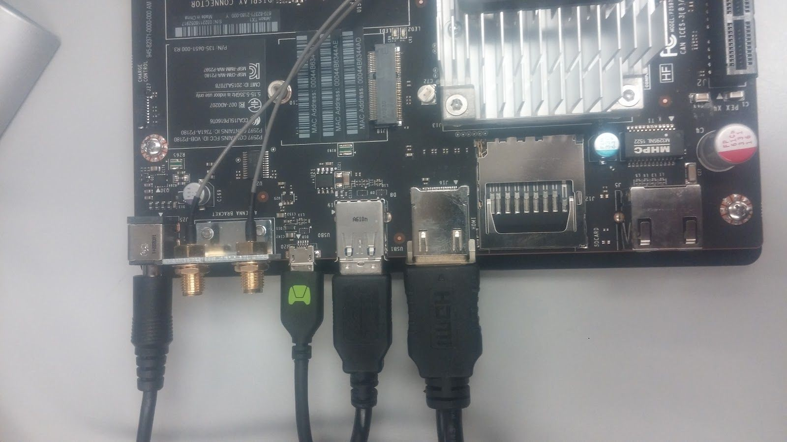

## On Jetson

On a high level, these are the things that need to be installed on the Jetson.<b/r>
1. Linux GUI<b/r>
2. Jetpack 3.2 flash<b/r>
3. A re-flash of the Connect Tech Orbitty<b/r>
4. ROS Kinetic<b/r>

### Connect terminals to the Jetson (aka “the device”)

(These instructions are also in the Jeston’s Quick Start Guide under “Force USB Recovery Mode”. Refer to it to see all the buttons, ports and whatnot.)<b/r>

Connect a display to the Jetson via HDMI port<b/r>

Connect a USB keyboard<b/r>

Connect the Jetson to your host PC via the USB micro-B plug Plug to power<b/r>

The Jetson should power on. If it doesn’t, push the ON button. Login: nvidia
Password: nvidia<b/r>


### Install Linux
Run
$ cat NVIDIA-INSTALLER/README.txt

And run the instructions that are in that file to install Ubuntu Linux. Note that TX1 comes with 14.04 LTS and TX2 comes with 16.04 LTS. There may be an additional step for TX1 if the course is using 16.04 LTS.<b/r>


### Flash the Jetpack
NOTE: you will need some 14GB of free space on the host computer for this step.<b/r>

Now that we have the GUI, we want to flash the Jetson with Nvidia’s Jetpack 3.2.<b/r>

To do this, we need a host computer that is running Linux 14.04 (it seems 16.04 also works - try it if that’s what you have). The Jetpack is first downloaded onto the host computer and then transferred by micro USB cable over to the Jetson. Follow these instructions: https://developer.nvidia.com/embedded/jetpack<b/r>

What if you don’t have a Linux 14.04 computer laying around? (most of us don’t). See ​Appendix A​ of this doc for an amazing set of instructions by Klein Yuan which details how to use a virtual machine with a Mac to do the flash. Steps would probably work similarly for a PC that is running Virtual Box.<b/r>


### Re-flash the Orbitty

After the Jetson has been flashed with Jetpack, we will actually need to re-flash it with the Connect Tech Orbitty firmware. Otherwise on the TX2 there can be issues with the USB 3.0 not working on the Orbitty carrier board. A great link to instructions is from NVIDIA-Jetson: https://github.com/NVIDIA-Jetson/jetson-trashformers/wiki/JetsonTM-Flashing-and-Setup-Guide-f or-a-Connect-Tech-Carrier-Board​. ​Note that each time you flash all of the files<b/r> will essentially be deleted from your Jetson​. So make sure to save any work you may have already done and upload it.
     
### Install ROS

Lastly, we will want to install ROS Kinetic. Jetson Hacks on Github has scripts to install ROS Kinetic.
- Here for TX2: ​https://github.com/jetsonhacks/installROSTX2​.
- And here for TX1: ​https://github.com/jetsonhacks/installROSTX1​.

### Wireless network setup (Penn ESE 680 only)

We could log into the Jetson using a monitor, keyboard, and mouse, but what about when we’re driving the car? Fortunately, the Jetson has Wi-Fi capability and can be accessed remotely via an SSH session.
Throughout this tutorial, you will be asked to configure the Jetson’s and your laptop’s network settings. Make sure to get these right! Using the wrong IP address may lead to conflicts with another classmate, meaning neither of you will be able to connect.<b/r>

## Connecting the car to the access point

1. Click the wireless icon at the top right of the screen and click the f110 network to start connecting to it. You will be prompted for a Wi-Fi password for the network: enter the password the TAs give you.
- It’s normal for the wireless icon to appear as if the Jetson is not connected immediately to the network since we still need to assign it an IP address.
2. In the same menu, click “Edit Connections.” In the pop-up value that appears, highlight the f110 network and click the Edit button.
3. Navigate to the IPv4 Settings tab and, under “Addresses,”, click the Add button.
- In the “Address” field, type ​192.168.2.xxx​, where ​xxx​ is your team’s number
plus 200. (For example, if I was on team 2, I would type ​192.168.2.202​.)
- In the “Netmask” field, type ​255.255.255.0​.
- In the “Gateway” field, type ​192.168.2.1​.
4. In the “DNS servers” field, type the same entry you used for the default gateway: 192.168.2.1​. (The router already has DNS servers configured in its internal settings.)
5. You should now be connected. Try opening Chromium and connecting to a site like Google, or using the ​ping​ utility from a terminal to test internet connectivity.
- If you experience signal strength issues, try moving closer to the router.
- If you can’t see the router at all, ensure that your Wi-Fi antennas are securely
connected to the Jetson. You can also try toggling the adapter on and off via the
“Enable Wi-Fi” option in the wireless settings menu.
- If you are connected to the router but can’t reach the internet, you may need to
set up the Hokuyo to not allow routing through it.
  
## Connecting your computer to the access point

Important Note​: when connecting your laptop to the router, use an IP address of the form 192.168.2.xxx​, where ​xxx​ is your team’s number multiplied by 4, added to 100, and then added to a number between 0 and 3 according to the alphabetical order of your last name in your team. For example, if I am on team 2, my name is Jack Harkins, and my teammates are Chris Kao, Sheil Sarda, and Houssam Abbas, I would add 1 since my last name (Harkins) comes second, making my final IP address ​192.168.2.209​.
Linux<b/r>

If you’re running Linux in a dual-boot configuration or as a standalone OS, the steps to connect are the same as those for the Jetson above; just make sure you use the correct IP address for your laptop instead of the one for the Jetson.
If you’re running Linux in a VM, connect your ​host​ computer to the router using the instructions below. Depending on which VM software you have and the default VM configuration, you may also need to set its network adapter configuration to NAT mode. This ensures your VM will share the wireless connection with your host OS instead of controlling the adapter itself.

### Windows
These instructions are for Windows 10, but they should be easily replicable on older Windows versions as well.
1. Click the wireless icon at the bottom right of the taskbar, select the f110 network, and click the Connect button. Enter the network password when prompted.
2. Right-click the same wireless icon and click “Open Network & Internet settings.” Click “Change connection properties” in the window that pops up.
3. Scroll down, and under “IP settings,” hit the Edit button. Change “Automatic (DHCP)” to manual, click the IPv4 slider, and enter the IP address, gateway, and DNS server as described previously.
- “Subnet prefix” should be set to ​24​, not ​255.255.255.0​ as you did with the Jetson.
- You can leave “Alternate DNS” blank.
- Remember to use the correct IP address for your computer; it should be different
from the one you used on the car.)
- If successful, the yellow exclamation mark on the wireless icon should go away. You can
test connectivity using the ​ping​ utility included with the Windows command prompt.

### Mac OS
TODO

### SSHiing into the car
The ​ssh​ utility is useful for gaining terminal access to your car when you don’t have a monitor around and when you don’t need to do visualization (e.g. via ​rviz​). Using this utility will give you the ability to edit and run your ROS code remotely and is especially useful when you want to rapidly develop and test new algorithms without the hassle a monitor can bring.

Before doing this, make sure both your laptop and car are connected to the f110 network as described ​here​.
1. Open a terminal on your laptop and type $ ​ssh <Jetson username>@<your car’s IP address​ to connect to the car. You will be prompted for your Jetson login password; type this in as well.
- The first time you SSH into the car, you will probably be told that the “authenticity of the host can’t be established.” Just type in “yes” and the dialog will not appear again.
2. If successful, you should see a prompt similar to ​ubuntu@tegra-ubuntu:~$​, which indicates that you’re now connected to the car’s terminal. Try starting ​roscore​ and running some ROS scripts. Don’t forget to source your working directory’s setup file beforehand.
3. Don’t forget that while you’re SSH’ed into the car, you’re running over the wireless network. Try not to get too far away from the car so you don’t accidentally get logged out, and make sure you ​save your work often​.

### Setting up Wireless Hot Spot on Jetson
As you begin to test on larger tracks, you may find a need to have a direct connection to your car, so as to not have to rely on the car being within a certain distance of your router. The solution here is to set up wireless hot spot on the Jetson. It is extremely easy.

Go to System Settings on your Jetson. Then Network.

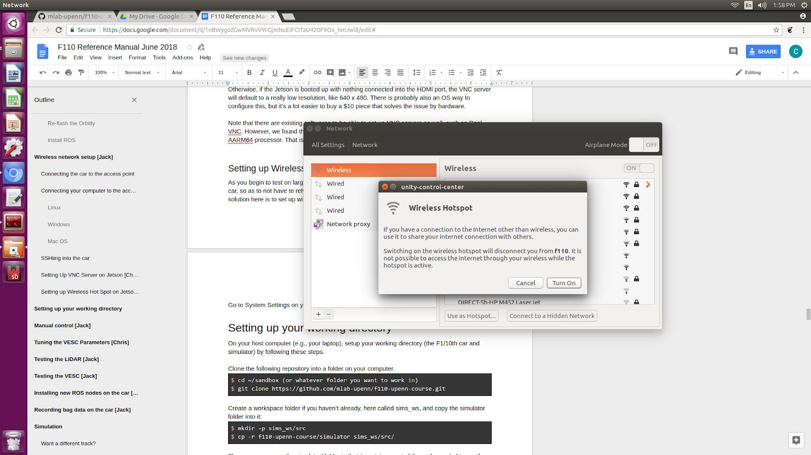

On the bottom center of the pop-up window for the network, click on “Use as Hotspot...” You will no longer have internet connection because your wireless antennas will now be used as a hot spot rather than to connect to the previous Wi-Fi connection that you were on.

Note that if you plan on using the wireless hotspot feature often, you will want it to boot up on startup. To do this, open up Network Connections, under Wi-Fi select Hotspot and Edit.

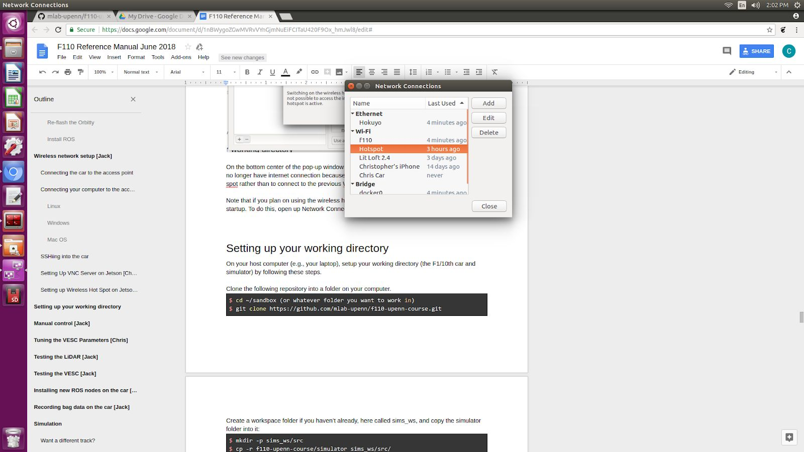

Under General click on “Automatically connect to this network when available”.

On your phone, tablet, or laptop you can now connect directly to this Hotspot, and you can use it with VNC viewer as well if you have set up a VNC server. The default IP address for Hotspot on the Jetson is 10.42.0.1.

### Setting Up VNC Server on Jetson
(This is not essential, just useful if you feel strongly about having a GUI-type of desktop)

Setting up a VNC server on the Jetson allows you to control the Jetson remotely. Why is this beneficial? When the car is running in the real world we won’t be able to connect the Jetson to an HDMI display. The traditional solution has been to ssh into the Jetson to see the directories, but what if we want to see graphical programs such as Rviz? (in order to see laser scans in live time and camera feeds). Or what if we want to be able to see multiple terminal windows open on the Jetson? A VNC server does this trick.

Here are sequential instructions to install x11vnc and set it up so it loads every time at boot up, taken from ​http://c-nergy.be/blog/?p=10426​. The article linked contains a link to a shell file to launch all these instructions. We have just pasted it here in case the original article or its link become inaccessible.

``` Markdown
#​ ​################################################################## #​ Script Name : vnc-startup.sh
#​ Description : Perform an automated install of X11Vnc
#​ Configure it to run at startup of the machine
#​ Date : Feb 2016
#​ Written by : Griffon
#​ Web Site :http://www.c-nergy.be - http://www.c-nergy.be/blog
#​ Version : 1.0
#
#​ Disclaimer : Script provided AS IS. Use it at your own risk.... #
#​ ​#################################################################
#​ Step 1 - Install X11VNC
#​ ​################################################################# sudo apt-get install x11vnc -y
#​ Step 2 - Specify Password to be used ​for​ VNC Connection
#​ ​#################################################################
sudo x11vnc -storepasswd /etc/x11vnc.pass
```


## Algorithms

### Wall Following

With our Hokuyo lidar sensor attached to the car, one of the simplest algorithms we can run is a
wall following algorithm. The basic idea is that the car uses the lidar sensor to measure the
distance to either the left wall, right wall, or both walls, and tries to maintain a certain distance
from the wall. Inside the wall_following package under /launch you will see a file called
wall_following.launch. <br/>

Run the following commands in terminal in order to see the robot do a simple left wall follow in
Gazebo simulator.

```markdown
$​ roscore (​ in​ a separate terminal window)
$​ ​ source​ devel/setup.bash
$​ roslaunch wall_following wall_following.launch
```
Now you should see the Gazebo simulator load with the car placed at the origin in our Levine
Building 2nd floor world. The car tries to maintain a certain distance of 0.5 meters from the left
wall, and will continue following it around left turns in a counter-clockwise fashion.
How is the code organized? From a high level view, data passes in this order:
pid_error.py -> control.py -> sim_connector.py <br/>
The main code for the wall_following is under wall_following/scripts/pid_error.py. In this script
you will find methods for followLeft, followRight, and followCenter. Pid_error.py subscribes to
the laser scan /scan topic and calls the callback function each time it gets new lidar data
(around 40 times per second). It uses PID to calculate the error and adjusts the steering angle
accordingly in order to try to keep its desired trajectory a certain distance away from the wall.
Pid_error.py then outputs over the /error topic a message type we custom defined called
pid_input which contains pid_vel and pid_error. Control.py subscribes to the /error topic and
limits the car’s turning angle to 30 degrees and slows down the car when it is making a turn, or
speeds up the car when it is going straight. Control.py publishes to the /drive_parameters topic
using our custom message type called drive_param which contains velocity and angle. Lastly,
sim_connector.py subscribes to /drive_parameters and basically repackages the velocity and
steering angle data into the AckermannDriveStamped message type so that it can be read in by
the simualtor under the /vesc/ackermann_cmd_mux/input/teleop topic. <br/>
If you run the Gazebo simulator long enough, you’ll notice that when the car reaches around 3⁄4
of the way through the track, it encounter an opening on the left that leads to a dead-end.Because the car is programmed to just do a wall follow, it gets stuck here. How might we
alleviate this problem? With hard-coded turn instructions, as described in the next section.
If you want to try running the wall following in the real world, run these instructions. Depending
on how wide the hallway is that the car is driving in, you may want to modify the parameters for
LEFT_DISTANCE and RIGHT_DISTANCE at the top of the pid_error.py file.

```markdown
$​ roscore (​ in​ a separate terminal window)
$​ ​ source​ devel/setup.bash
$​ roslaunch real_world_wall_following wall_following.launch
```

### Wall Following with Explicit Instructions
If we do a simple wall follow (left, right, or center), the robot will always make turns at openings it
sees. But sometimes we may not want the robot to turn into an opening because it dead ends,
or we just want it to keep going down the hallway. The idea in this section is to give the robot a
sequence of turn instructions, which it calls sequentially each time it sees an opening. For
instance, imagine in the Levine World telling the robot to turn [“left”, “left”, “left”, “center”, “left”].
The “center” would allow it to skip the dead end opening and continue straight with a center wall
follow instead. Explicit instructions also includes velocity instructions. <br/>

To run the hard-coded turn instructions code in the simulator, do the following in your terminal.

```markdown
$​ roscore (​ in​ a separate terminal window)
$​ ​ source​ devel/setup.bash
$​ roslaunch real_world_wall_following_explicit_instructions.launch
```

To change the instructions, navigate to the explicit_instructions/instructions.csv file and change
the values. You will see something that looks like this:

```markdown
left, 1.5
left, 2.0
left, 1.0
center, 0.5
left, 2.0
center, 1.5
stop, 0.0
```

The first value is the turn instruction and the second value is the velocity which gets executed
after making that turn for some duration of time specified in the
pid_error_explicit_instructions.py file.


The core logic is contained in the file wall_following/scripts/pid_error_explicit_instructions.py.
There are a lot of comments in the code that describe the algorithm. At a high level, the car is
constantly scanning for an opening by subscribing to the laser scan data . If the car detects an
opening, then it takes the next instruction off of the turn instruction array and commits to that
turn instruction for a specified number of seconds. The reason we commit for some seconds is
that we don’t want the car to mistakenly think it sees a “new” opening midway through a turn,
and prematurely call the next turn instruction.


How does the robot detect an opening? The robot scans to the right (and left as well) between
some window of degrees. It compares lidar scans sequentially (so for instance, 0 degrees vs
0.25 degrees) and checks if the distance measured to 0 degrees and the distance measured to
0.25 degrees has a difference of some distance in meters. If there is a dropoff distance, then we
know there is an opening.


A challenge we ran into is reflections off of metal plates on the doors in Levine Building. The
robot calculated these as openings because Lidar data showed the points reflecting off the
metal to be 60 meters away! Our solution was to ignore points that were further than 40 meters
away because we know that they are metal.


You will also notice that in the real_world_wall_following_explicit_planning.launch file, we call a
dead_mans_switch.py node. This allows us to use the joystick and the car only moves when the
top right dead mans switch bumper is held down. This is for safety reasons.

If you notice your car is oscillating a lot on straightaways, try turning the kp value down in
control.py.


Wall following with hard coded turns is a tedious algorithm because it requires us to manually
predict where the car will detect openings before we launch the algorithm. Sometimes the car
detects openings unpredictably, such as when it passes by an office with glass walls or when it
goes down the ramp from Levine 3rd floor into Towne. This causes the car to prematurely take
the next instruction set, which then interferes with the rest of the instruction sets. Hence we
move on to localization and mapping next in search of a better solution to autonomous driving
that doesn’t require as much human input and is more robust.
[Back to Top](#table-of-contents)


### Gap-finding in LiDAR scans [Houssam]
The topic on which lidar information messages are published is the /scan topic.If you ​run the simulator​ and run ​$rostopic info /scan​ , you will see the messages are of
type std_msgs/LaserScan.

### Scan Matching Odometry [Sheil]
ROS’ ​ laser_scan_matcher​ package performs scan matching odometry.

#### Installing Packages
``` Markdown
$ sudo apt-get install ros-kinetic-amcl
$ sudo apt-get install ros-kinetic-scan-tools
```

#### Getting the example launch file
The f110 repo contains a launch file that demonstrates running the laser_scan_matcher
on pre-recorded bag data. Copy it into your workspace’s src/ folder, e.g.
$​ cp -r f110-course-upenn/algorithms/localization src/


This folder defines a package, ​ localization​ , which uses ROS’ ​ laser_scan_matcher
package.


Re-source your setup.bash, and you should be able to run

```markdown
$​ rospack find localization
```

The majority of the parameters in the ​ laser_scan_matcher​ node are taken from the
ROS docs on the ​ laser_scan_matcher​ package, available here​ .


In order to run the ​ laser_scan_matcher​ on the pre-recorded bag file, execute the
following lines in your terminal.


```markdown
$ roslaunch localization laser_scan_matcher.launch
```
If you don’t want to see RViz, change the use_rviz arg in the launch file to “false”.
The rostopic printing the pose of the car and covariance matrix is called
/pose_with_covariance_stamped . You can read about it online.
[Back to Top](#table-of-contents)


### Localization With Hector SLAM
We use Hector SLAM in order to generate a map given a bag file. First install hector-slam.
```markdown
$​ sudo apt-get install ros-kinetic-hector-slam
```
Run these following commands in order to reproduce it on your machine.
```markdown
$​ roslaunch localization hector_slam.launch
```
You will see an Rviz window open up that maps out the Moore Building 2nd floor loop. The
launch file reads in a bag file which recorded all of the topics. Hector SLAM only needs the
/scan topic (which contains the laser scans) in order to simultaneously map and localize. Note
that no odometry data is used, whereas more advanced mapping packages such as Google
Cartographer have the option to use odometry data and even IMU data.


Once the map is completely generated, in a new terminal window run the following in order to
save the map as a yaml. The last string after “-f” is the name of the map you’d like to save.
Since in this case we are using the Moore Building bag file, we appropriately name the map
“moore”.


```markdown
$​ rosrun map_server map_saver -f moore
```
Now you will see in your home directory a levine.yaml file and a moore.pgm file. You will need
both of these. We have already copied and pasted a version of this under
localization/localization/maps/moore.yaml, as well as its corresponding moore.pgm file.
Now that you have Hector SLAM working, we can dive a bit more into the details of the
hector_slam.launch file. At the top of the file you will see that we set the parameter
/use_sim_time to true because the launch file plays a bag file. In this case, it’s a bag file
recorded while the car did a single loop around Moore. Whenever we play bag files, it’s
important to include the --clock argument because it causes ROS to play bag files with
simulated time synchronized to the bag messages
(​ https://answers.ros.org/question/12577/when-should-i-need-clock-parameter-on-rosbag-play/​ .
After the rosbag play instruction in the hector_slam.launch file, you will notice that there is a
tf2_ros transform node that transforms between base_link to laser. This is very important to
include or else Hector SLAM will not know where the laser is relative to the center of gravity of
the car. In this case we use a static transform since the laser does not move relative to the car.
After the tf2_ros transform instruction in the launch file, you will see a reference to the
hector_mapping mapping_default.launch file with parameters that specify the names of the
base_frame, odom_frame, map_size, scan_topic, etc. Then there is a hector_geotiff which is
used to save the map as a Geotiff file. Lastly, we launch rviz with a specific rviz_cfg (Rviz
configuration) so that we don’t have to select all the topics we want to visualize every time weopen up Rviz. As a special note of interest, in algorithms below if you see in the launch file that
there is a --delay of a few seconds added to Rviz, the reason is probably that we need to give
Rviz time for certain nodes that generally take longer to publish to start publishing, otherwise
Rviz will get old data.


If your hector_slam.launch isn’t working correctly, a good way to debug is to compare your
rqt_graph and rqt_tf_tree to the ones we have screenshotted below.

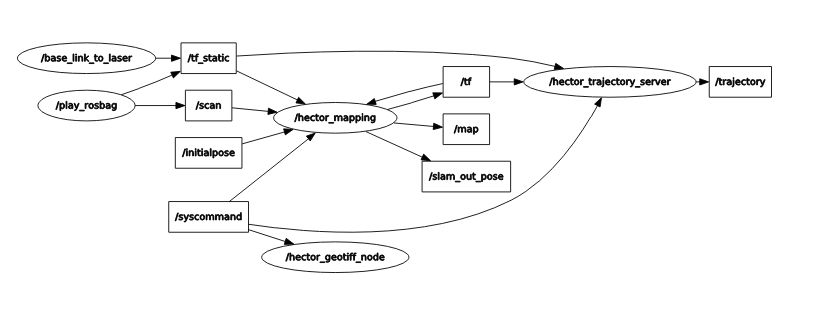
Rqt_graph for Hector SLAM generated by running “rosrun rqt_graph rqt_graph”

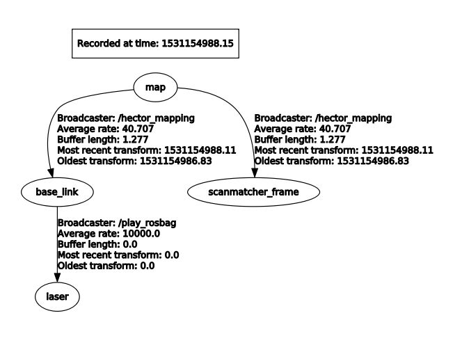
Rqt_tf_tree generated for Hector SLAM by running “rosrun rqt_tf_tree rqt_tf_tree”
[Back to Top](#table-of-contents)


### Markdown
{:.no_toc}

Markdown is a lightweight and easy-to-use syntax for styling your writing. It includes conventions for

```markdown
Syntax highlighted code block

# Header 1
## Header 2
### Header 3

- Bulleted
- List

1. Numbered
2. List

**Bold** and _Italic_ and `Code` text

[Link](url) and 
```

For more details see [GitHub Flavored Markdown](https://guides.github.com/features/mastering-markdown/).

### Jekyll Themes
{:.no_toc}

Your Pages site will use the layout and styles from the Jekyll theme you have selected in your [repository settings](https://github.com/hanmingz/f1tenthmanual/settings). The name of this theme is saved in the Jekyll `_config.yml` configuration file.

[Back to Top](#table-of-contents)

## Support or Contact
Contributors to this [Manual](http://f1tenth.org/car-assembly):
Houssam Abbas - Assistant Professor, Oregon State University
Jack Harkins - University of Pennsylvania
Chris Kao - University of Pennsylvania
Matthew O’Kelly - University of Pennsylvania
Sheil Sarda - University of Pennsylvania

Having trouble with Pages? Check out our [documentation](https://help.github.com/categories/github-pages-basics/) or [contact support](https://github.com/contact) and we’ll help you sort it out.

