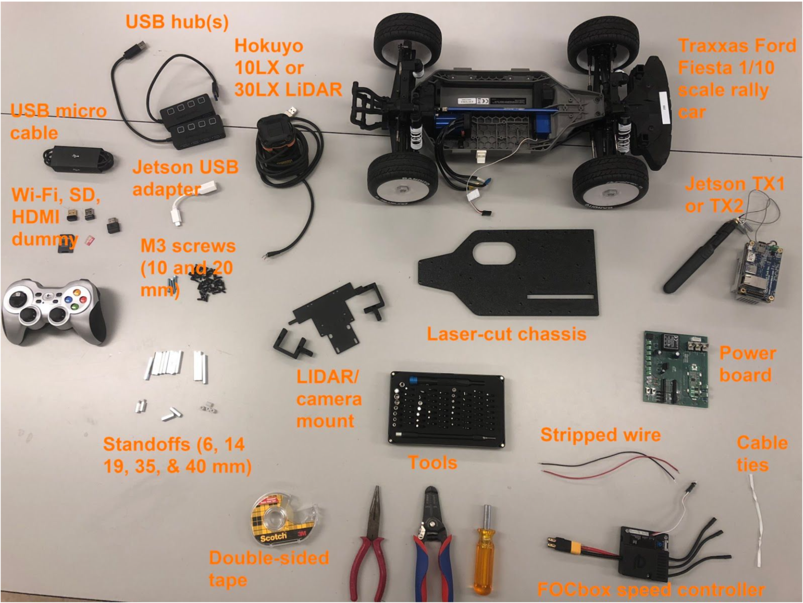

# Welcome to manual page of F1/10!
{:.no_toc}

This site will be the future place of reference for F1/10 race cars! But it is a work in progress for now, so place refer to [Car Assembly Page](http://f1tenth.org/car-assembly) to look at the pdf manual


# Table of Contents
{:.no_toc}
1. The generated Toc will be an ordered list
{:toc}

---

## What you need to start

### Miscellaneous
(1) Laptop with Ubuntu Xenial 16.04.01 LTS installed. (Other versions of Ubuntu may work as well, but we can’t guarantee this.)

### The hardware kit
#### Mechanical
(1) Traxxas RC rally car (recommended model: Ford Fiesta ST)<br/>
Note: as of August 2018, this car is sold with a brushed motor by Traxxas. See link below for brushless motor.
(1) [Velineon 3351R/3500 brushless DC motor](​https://www.amazon.com/Traxxas-Velineon-Brushless-Motor-3500Kv/dp/B00XWTXOCC/ref=sr_1_5?s=toys-and-games&ie=UTF8&qid=1533078584&sr=1-5&keywords=3351r&dpID=412p2cEdtOL&preST=_SX342_QL70_&dpSrc=srch)<br/>
(1) laser-cut chassis on which you will mount everything<br/>
(1) LIDAR mount with (2) C-shaped brackets<br/>
(2) threaded 14mm M3 standoffs<br/>
(4) 19mm M3 standoffs<br/>
(8) 35mm M3 standoffs<br/>
(4) 45mm M3 standoffs<br/>
(35) 10mm M3 screws<br/>
(4) 20mm M3 screws<br/>
(4) 8mm round nylon spacers<br/>
(1) Roll of double-sided tape (for mounting USB hubs and optionally FOCbox)<br/>

[Back to Top](#table-of-contents)

#### Electrical
(1) power board (obtained from University of Pennsylvania team. This was designed at Penn, printed by ​ www.4pcb.com​ )<br/>
(1) Nvidia Jetson TX1 or TX2 with Wi-Fi antennas (included with the development board)<br/>
(1) Orbitty carrier board (for Jetson)<br/>
(1) Hokuyo 10LX or 30LX LIDAR<br/>
(1) Traxxas LiPo or NiMH battery (at least 9V)<br/>
(1) FOCbox or VESC 4.12 electronic speed controller<br/>
(1) USB hub (at least 6 ports)<br/>
(1) short (~1 ft) USB micro cable<br/>
(2) spools/strips of 22 AWG wire of different colors (preferably red and black)<br/>
(1) USB keyboard and mouse<br/>
(1) HDMI display<br/>
Optional: (1) HDMI dummy plug and (1) USB Wi-Fi adapter for connecting to the car via VNC

#### Tools
(1) Metric ruler<br/>
(1) Needle-nose pliers<br/>
(1) Wire strippers<br/>
(1) 2mm width or smaller flathead screwdriver<br/>
(1) 5/64 inch diameter hex driver key or small Phillips screwdriver (1) Hex socket driver or wrench (to hold standoffs in place)<br/>
(1) T3 Torx screwdriver<br/>



## Preparing and Assembling the Car

[Back to Top](#table-of-contents)

### Markdown
{:.no_toc}

Markdown is a lightweight and easy-to-use syntax for styling your writing. It includes conventions for

```markdown
Syntax highlighted code block

# Header 1
## Header 2
### Header 3

- Bulleted
- List

1. Numbered
2. List

**Bold** and _Italic_ and `Code` text

[Link](url) and 
```

For more details see [GitHub Flavored Markdown](https://guides.github.com/features/mastering-markdown/).

### Jekyll Themes
{:.no_toc}

Your Pages site will use the layout and styles from the Jekyll theme you have selected in your [repository settings](https://github.com/hanmingz/f1tenthmanual/settings). The name of this theme is saved in the Jekyll `_config.yml` configuration file.

[Back to Top](#table-of-contents)

## Support or Contact
Contributors to this [Manual](http://f1tenth.org/car-assembly):
Houssam Abbas - Assistant Professor, Oregon State University
Jack Harkins - University of Pennsylvania
Chris Kao - University of Pennsylvania
Matthew O’Kelly - University of Pennsylvania
Sheil Sarda - University of Pennsylvania

Having trouble with Pages? Check out our [documentation](https://help.github.com/categories/github-pages-basics/) or [contact support](https://github.com/contact) and we’ll help you sort it out.

