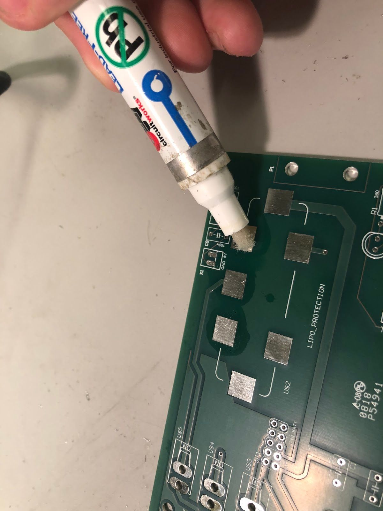
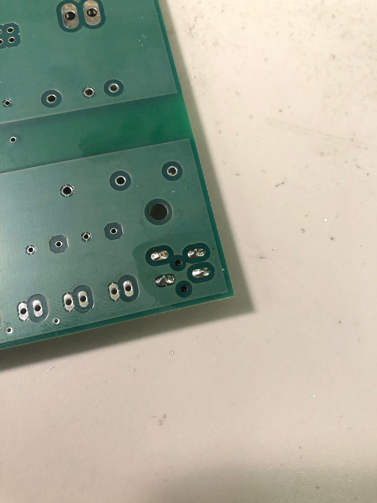
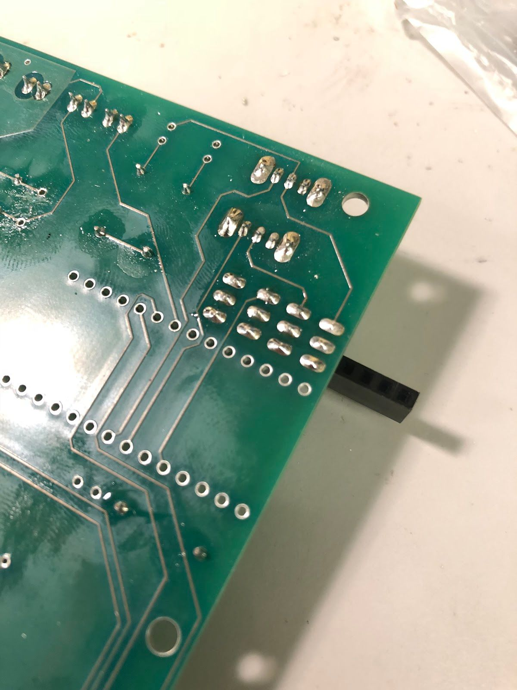

# Welcome to manual page of F1/10!
{:.no_toc}

This site will be the future place of reference for F1/10 race cars! But it is a work in progress for now, so place refer to [Car Assembly Page](http://f1tenth.org/car-assembly) to look at the pdf manual


# Table of Contents

sidebar:
  nav: "docs"
  
{:.no_toc}
1. The generated Toc will be an ordered list
{:toc}

---

## What you need to start

### Miscellaneous
(1) Laptop with Ubuntu Xenial 16.04.01 LTS installed. (Other versions of Ubuntu may work as well, but we can’t guarantee this.)

### The hardware kit
#### Mechanical
(1) Traxxas RC rally car (recommended model: Ford Fiesta ST)<br/>
Note: as of August 2018, this car is sold with a brushed motor by Traxxas. See link below for brushless motor.
(1) [Velineon 3351R/3500 brushless DC motor](​https://www.amazon.com/Traxxas-Velineon-Brushless-Motor-3500Kv/dp/B00XWTXOCC/ref=sr_1_5?s=toys-and-games&ie=UTF8&qid=1533078584&sr=1-5&keywords=3351r&dpID=412p2cEdtOL&preST=_SX342_QL70_&dpSrc=srch)<br/>
(1) laser-cut chassis on which you will mount everything<br/>
(1) LIDAR mount with (2) C-shaped brackets<br/>
(2) threaded 14mm M3 standoffs<br/>
(4) 19mm M3 standoffs<br/>
(8) 35mm M3 standoffs<br/>
(4) 45mm M3 standoffs<br/>
(35) 10mm M3 screws<br/>
(4) 20mm M3 screws<br/>
(4) 8mm round nylon spacers<br/>
(1) Roll of double-sided tape (for mounting USB hubs and optionally FOCbox)<br/>

[Back to Top](#table-of-contents)

#### Electrical
(1) power board (obtained from University of Pennsylvania team. This was designed at Penn, printed by ​ www.4pcb.com​ )<br/>
(1) Nvidia Jetson TX1 or TX2 with Wi-Fi antennas (included with the development board)<br/>
(1) Orbitty carrier board (for Jetson)<br/>
(1) Hokuyo 10LX or 30LX LIDAR<br/>
(1) Traxxas LiPo or NiMH battery (at least 9V)<br/>
(1) FOCbox or VESC 4.12 electronic speed controller<br/>
(1) USB hub (at least 6 ports)<br/>
(1) short (~1 ft) USB micro cable<br/>
(2) spools/strips of 22 AWG wire of different colors (preferably red and black)<br/>
(1) USB keyboard and mouse<br/>
(1) HDMI display<br/>
Optional: (1) HDMI dummy plug and (1) USB Wi-Fi adapter for connecting to the car via VNC
[Back to Top](#table-of-contents)

#### Tools
(1) Metric ruler<br/>
(1) Needle-nose pliers<br/>
(1) Wire strippers<br/>
(1) 2mm width or smaller flathead screwdriver<br/>
(1) 5/64 inch diameter hex driver key or small Phillips screwdriver (1) Hex socket driver or wrench (to hold standoffs in place)<br/>
(1) T3 Torx screwdriver<br/>
[Back to Top](#table-of-contents)


## Preparing and Assembling the Car


### Preparing the Car 

TODO: will fill out when the fourth Traxxas car arrives<br/>

Obtaining the Power Board<br/>
[1. Instructions on getting the power board from Penn,
2. and a link to files that you would send to a PCB company like 4PCB or PCBWay. Currently on github ​https://github.com/mlab-upenn/f1tenth-dev/tree/master/power-board-v2.0​ ]<br/>
 
A note on why we have a power board:​ The power board is used to provide a stable voltage source for the car and its peripherals since the battery voltage drops as the battery runs out. The board does not do any charging of the battery, so you will need a Traxxas EZ-Peak charger to charge it (you can find them on Traxxas' website). At present, there's no way to know the battery's charge level except by measuring it with a multimeter or the BLDC Tool as it runs, but we could think about adding a low voltage LED or seven-segment LCD display (to show the voltage) to the next iteration of the board. The LIPO protection module and green connectors are currently unused and are a legacy from previous F1/10 car iterations which used the Teensy microcontroller as a motor driver.<br/>
[Back to Top](#table-of-contents)


### Installing the Body Standoffs

Begin by installing four 45mm M3 standoffs into the holes of the main car body pictured below. Secure the standoffs to the bottom of the car using 10mm M3 screws, and use either nosepliers or a hex driver to hold the standoff in place while you turn the screw on the other side. Pay attention to where you install the standoffs since there are several mounting holes on the car's base. See the picture below for clarification.<br/>

Next, install two threaded 14mm M3 standoffs into the front holes in the car base, using the pliers or hex driver to thread the standoffs into the holes. Don't mount the chassis to the car yet since we still need to mount the Jetson and power board to the chassis.<br/>


[Back to Top](#table-of-contents)


### Mounting the FOCbox to the Chassis
Feed the three motor wires for the FOCbox through the rectangular slot in the chassis as shown below.


Alternate method of securing the FOCbox if screws don’t fit​ : Some FOCboxes (the more recently-made ones) have smaller screw holes that won’t fit M3-size screws. If this is the case for your FOCbox, you can use a few pieces of double-sided tape to secure the FOCbox instead.<br/>


[Back to Top](#table-of-contents)

### Installing the Chassis Standoffs
Mount eight 35mm M3 standoffs to the ​ glossy side​ of the black laser-cut chassis in the
positions shown below. Thread 10mm M3 screws through the drill holes and screw
them into the standoffs to secure them. (​ Important​ : If you do not mount the standoffs to
the glossy side, the power board won't fit since the screw holes will be misaligned.) <br/>

Note there are several drill holes in the chassis, so make sure you’re using the right
ones. In the image below, the 4 screws on the left(which is the back of the car) will
eventually hold the power board, so that’s a good way to see if they’re properly placed.
The 4 screws on the right (2 on each side of the oval cutout) will eventually hold the
Orbitty carrier attached to the Jetson.<br/>


Mount two more (19mm M3) standoffs to the front part of the chassis for the LIDAR, and
secure with 10mm screws. The top part of the chassis should look like the picture
below.


[Back to Top](#table-of-contents)


### Detaching the Jetson from the Development Board
When you purchase a Jetson, it is attached to a development board. In order to use it
on the car, you will need to unscrew the Jetson and its Wi-Fi antenna from the
development board.<br/>
Before you remove the antenna, you will need to remove the bottom plate from the
development board. Remove the four screws marked below and lift the development
board away from the plate.<br/>


Next, remove the Wi-Fi antenna by unscrewing the two screws marked below. Keep the
screws in a safe place, as you’ll use them in a bit to attach the antennas to standoffs. <br/>


Remove the two brass-colored nuts holding the antennas to the L-shaped bracket, and
then remove the two antennas from the bracket. It helps to use two pairs of pliers: one
to hold the rear nuts in place and another to unscrew the nuts on the end with the
antenna connectors.<br/>


Using a Phillips screwdriver, thread the two screws you saved earlier completely into
the bracket as pictured below. Attach two standoffs to the opposite ends of the screws
and hand-tighten them until they won’t turn anymore. Use the pliers to tighten the
standoffs more while you hold the head of the screw in place using the screwdriver.
Once you’ve done these steps, place the antennas and washers back into the bracket,
and tighten the brass nuts onto the threaded connectors again.<br/>


Unplug the Jetson’s fan and remove the Jetson from the development board by using a
T3 Torx screwdriver to unscrew the Jetson (the large silver heat sink), and then pull up
gently to detach it from the development board. Keep the Jetson in a safe place while
you attach the antennas to the power board.<br/>


[Back to Top](#table-of-contents)


### Mounting the Wi-Fi Antennas to the Power Board
Attach the two standoffs for the Wi-Fi antenna bracket to the power board, making sure
the antennas, when installed and extended, lie ​ over ​ the board and now away from it.
Install the two black antennas onto the threaded connectors if they aren’t already on.<br/>


Attach the two wires for the Jetson Wi-Fi antenna to the two gold-colored connectors
near the fan connector on the heat sink (the order of the wires doesn’t matter). This can
be a little tricky, so you might want to use a flathead screwdriver to ensure the
connections are tight. ​ Don’t press too hard​ , however as you can easily damage the
connectors if you use excessive force!


[Back to Top](#table-of-contents)

### Mounting the Power Board to the Chassis

Screw the power board onto its chassis standoffs using 10mm M3 screws. The screw
positions are indicated with arrows below.


[Back to Top](#table-of-contents)


### Attaching the Orbitty to the Jetson
Attach the Orbitty to the Jetson by connecting the two long black ports and connect the Jetson’s
fan to the Orbitty’s fan connector as shown in the pictures below..


[Back to Top](#table-of-contents)


### Connecting the Jetson and Power Board
Cut two 8-inch pieces of wire of different colors (preferably red and black), and strip
both ends to a short length (1/8 inch). Locate the green terminal block on the Jetson
and attach one end of one wire to the + ​ Vin​ terminal, and the other end to one of the
green 1 ​ 2V​ terminals on the power board. (Any of the 12 volt terminals are acceptable. To
attach, insert the stripped end into the terminal and screw the little screw tight with a
small flathead screwdriver.) Attach the other stripped wire to the G ​ ND​ terminal on the
Jetson and to the G ​ ND​ terminal on the corresponding terminal block on the power board.


[Back to Top](#table-of-contents)

### Mounting the Jetson to the Chassis
Your kit comes with four white plastic standoffs; place these between the Jetson PCB
and heatsink (see picture) ​ before ​ threading the screws through. Otherwise, you risk
bending the Orbitty while screwing it in. Use 20mm screws to secure the Jetson to its
chassis standoffs.


Ensure that when you mount the Jetson that the wires for neither the Wi-Fi antenna nor
the Jetson's power connections get pinched. It might help to tuck both sets of wires
underneath the power board. (Don't tuck them underneath the Jetson because they
might restrict airflow or obstruct the fan's blades.) Your configuration should now look
something like this:


[Back to Top](#table-of-contents)

### Mounting the Chassis to the Car Underbody
Place the chassis onto the five standoffs on the car base and align the chassis’ drill
holes with the car’s base standoffs you attached earlier as shown below. Use six 10mm
M3 screws to secure the chassis to the standoffs.


[Back to Top](#table-of-contents)

### Mounting the LIDAR
The LIDAR should have two cords: one for power and another for either Ethernet or
USB. Cut the end of the power cord, leaving 1-2 feet of cable. Strip the end, cut away all
wires except for the blue and brown ones, and strip those two wires to 1/8 inch as
shown below.


Attach the LIDAR to the tree-shaped base using two (10LX) or four (30LX) screws, such
that the wires protruding from the LIDAR go towards the back of the car. (For the 30LX,
the two LEDs at the top of the LIDAR should face the front of the car.) Then mount the
C-shaped brackets to the black tree-shaped base as shown in the pictures below. ​ Note:
if the black mount does not fit in the holes of the C brackets, sand the inserts until they
do.


Mount the LIDAR to the car by fitting the two thick protruding parts of the mounting
brackets into the holes. The open part of the "C" in the brackets should face forward as
shown below.


If you completed the previous steps correctly, two of the holes on the narrow end of the
LIDAR base should match up with the two 19mm standoffs you mounted earlier. Wind
the power and USB cords of the LIDAR around its base so that there is just enough
available to plug into the power board and Jetson, with a little bit of slack so that it is not
too tight. Tuck both cords under the LIDAR mounting plate between the two silverstandoffs, and secure the LIDAR base to the standoffs on the chassis using two 10mm
M3 screws.

[Back to Top](#table-of-contents)


### Mounting the USB Hubs
Attack two pieces of double-sided tape to a USB hub. Place the hub onto the empty space of
the chassis directly below the Jetson and to the right of the power board as shown. If your hub
has power buttons, make sure all of them are turned on.<br/> 


If you need more USB ports (required if your LiDAR uses USB), you can stack a second hub
onto the top of the first. Again, use double-sided tape to secure the second hub and make sure
all power buttons are on.<br/>

Plug the first USB hub into the Orbitty board. If you’re using a second hub, use the white micro
USB adapter that comes with the Jetson to plug in the second hub.


### Connecting the LIDAR

Attach the LIDAR's power cable to a free 12V terminal block on the power board. The brown wire should go to the 12V terminal, and the blue wire should go to the corresponding GND terminal. The side of the LIDAR has a pinout as well if you forget.


If the LIDAR has an Ethernet cable, attach it to the Ethernet port on the Jetson. If it has a USB cable, plug it into the USB hub. Route any excess cables behind the USB hubs as shown. <br/>


### Connecting the FOCbox

Pass the 3 round FOCbox wires through the rectangular slot in the plastic chassis, then connect the 3 circular bullet connectors to the three motor wires. (The order in which you connect the wires kinda doesn’t matter (electrically speaking). If you run the car and it goes backwards when it should go forwards, you can swap any two of the three wires.) Connect the 3-wire servo ribbon cable as well, making sure the colors match up. <br/>


If your micro USB cable is thin enough, thread it through the rectangular wire slot and around the FOCbox to the USB connector as shown below, or route it around the rear end of the chassis if it isn’t. Plug the cable into the FOCbox’s USB connector and into a free port on your USB hub. Tie the USB cable up using a cable tie, and tuck all of the wires underneath the chassis. You can also use this time to plug in the LIDAR (if it is USB), the external Wi-FI adapter, and the receiver for the F710 gamepad.


### Connecting the Car to the Battery

Connect the battery to the FOCbox using the battery connector. ​Make sure that red is aligned with red and black is aligned with black - otherwise things will get hot and dicey. ​Then connect the FOCbox to the power board using the white port shown in the picture below. <br/>


At this point, your car should be assembled, the Jetson lights should flash when you flip the power switch, and the car is ready to run!  <br/>

Note: At present, there's no way to know the battery's charge level except by measuring it with a multimeter as it runs. You might consider adding a low voltage LED or seven-segment LCD display (to show the voltage). <br/>

[Back to Top](#table-of-contents)


### Tuning the FOCbox’s PID Gains

In this section we use the words FOCbox and VESC interchangeably.

Important Safety Tips<br/>

- Make sure you hold on to the car while testing the motor to prevent it from flying off the stand. <br/>
- Make sure there are no objects (or people) in the vicinity of the wheels while testing.<br/>
- It’s a good idea to use a fully-charged LiPO battery instead of a power supply to ensure the motor has enough current to spin up.<br/>

1. Put your car on an elevated stand so that its wheels can turn without it going anywhere. If you don’t have an RC car stand, you can use the box that came with your Jetson.<br/>

2. Connect the host laptop to the FOCbox using a USB cable.<br/>

3. Download bldc tool from JetsonHacks (​https://github.com/jetsonhacks/installBLDC​),
following his instructions for installation.<br/>

4. Open BLDC Tool and click the “Connect” button at the top right of the window to connect
to the VESC.
- If you get the error “Device not found”, try running the command ​lsusb​ in a
terminal. You should see an entry for “STMicroelectronics STMF407” or something similar. If you don’t, try unplugging and plugging in the USB cable on both ends. If the problem doesn’t go away, try rebooting the Jetson.<br/>


- If you are using a VESC 4.12 (including a FOCbox), ensure the firmware version is 2.18.


5. Disable keyboard control by clicking the “KB Ctrl” button at the lower right. This will prevent your keyboard’s arrow keys from controlling the motor and is important to prevent damage to the car from it moving unexpectedly.


6. Start plotting the realtime RPM data by clicking the “Realtime Data” tab, and checking the “Activate sampling” checkbox at the bottom left of the window. Click the “RPM” tab above the graph.
- We will keep referring to this plot of the motor’s RPM as we tune the PID gains. Out goal is to get the motor to spin up as quickly as possible when we set it to a certain RPM. We also don’t want the motor to cog (not spin) or overshoot the target speed if possible.


7. Test the motor first (without PID speed control) by setting the “Duty Cycle” to 0.20. This will spin the motor up to approximately 16,000 - 17,000 RPM. Let this run for a few seconds, and then press the “Release Motor” button at the bottom right to stop it.
- Observe the RPM graph. If the motor is spinning backwards (the RPM is negative), try reversing two of the connections from the VESC to the motor. (It doesn’t matter which wires you reverse.)
- If the wheels don’t spin and the motor makes no noise, check to make sure all connections to the motor are tight.
- If the wheels don’t spin and the motor does, ensure the motor’s gear is attached correctly to the gearbox at the back of the car. Spin both front wheels with your hand to verify that the gear is making good contact. You should feel some resistance when turning the wheels.
- If the motor doesn’t spin and makes a humming or hissing sound, you might need to replace the motor. If this doesn’t work, try replacing the VESC.


8. Click the “Motor Configuration” tab at the top and the “Advanced” tab on the left. Set Ki and Kd to 0.00000, and set Kp to 0.00001. Click the “Write Configuration” button at the bottom, go back to the data plotting tab and run the car at 3000 RPM.
- You will notice that the car won’t even make it close, as it only goes up to around 1200 RPM. (High steady-state error.)
- Try turning Kp up to 0.00002, 0.00004, and 0.00008. (Don’t forget to write the configuration each time.) The motor will start to cog out at higher Kp values.


9. Set Kp back to 0.00002, and set Ki to 0.00002, and run the car at 3000 RPM again. Notice how the car slowly reaches the 3000 RPM target. (This is because adding Ki helps to eliminate steady-state error.)
- Keep increasing Ki; set it to 0.00005 and then double that value a few times until the car is able to reach 3000 RPM without overshooting or cogging out.<br/>

10. Now, try increasing the speed to 6000 RPM.<br/>
- The motor might cog out and overshoot. If it does, try halving Kp.<br/>

11. Increase the speed to 10,000 RPM and then 20,000 RPM. ​Make sure you hold the car!
- If the motor cogs out and overshoots, halve Kp until it doesn’t.<br/>
- It may also help to halve Ki if halving Kp doesn’t work.<br/>
- If done correctly, the motor should not overshoot to more than 2 times the set<br/>
RPM. (That is, if the RPM is set to 15,000, its peak value should not exceed 30,000.)

[Back to Top](#table-of-contents)


### LiPo (Lithium Polymer) Battery Safety

LiPO batteries allow your car to run for a long time, but they are not something to play with or joke about. They store a large amount of energy in a small space and can damage your car and cause a fire if used improperly. With this in mind, here are some safety tips for using them with the car.<br/>

- When charging batteries, always monitor them and place them in a fireproof bag on a non-flammable surface clear of any other objects.<br/>
- Do not leave a LIPO battery connected to the car when you’re not using it. The battery will discharge and its voltage will drop to a level too low to charge it safely again.<br/>
- Unplug the battery from the car immediately if you notice any popping sounds, bloating of the battery, burning smell, or smoke.<br/>
- Never short the battery leads.<br/>
- Do not plug the battery in backwards. This will damage the VESC and power board (and
likely the Jetson as well) and could cause a short circuit.<br/>

See ​this video​ and ​this video​ for examples of what might happen if you don’t take care of your batteries. Be safe and don’t let these happen to you!<br/>

[Back to Top](#table-of-contents)

# Basic software install

## On Your Laptop

### Supported Versions 

You will need to install the OS Ubuntu Xenial 16.04.01 and ROS Kinetic. 
Could other combinations work? Sure.
Will we support them? Nope.

[Back to Top](#table-of-contents)


## Install ROS

Go to ROS.org and follow the instructions there to install the version of ROS referenced above.


## On Jetson

On a high level, these are the things that need to be installed on the Jetson.
1. Linux GUI
2. Jetpack 3.2 flash
3. A re-flash of the Connect Tech Orbitty
4. ROS Kinetic

### Connect terminals to the Jetson (aka “the device”)

(These instructions are also in the Jeston’s Quick Start Guide under “Force USB Recovery Mode”. Refer to it to see all the buttons, ports and whatnot.)

Connect a display to the Jetson via HDMI port

Connect a USB keyboard

Connect the Jetson to your host PC via the USB micro-B plug Plug to power

The Jetson should power on. If it doesn’t, push the ON button. Login: nvidia
Password: nvidia


[Back to Top](#table-of-contents)


### Install Linux
Run
$ cat NVIDIA-INSTALLER/README.txt

And run the instructions that are in that file to install Ubuntu Linux. Note that TX1 comes with 14.04 LTS and TX2 comes with 16.04 LTS. There may be an additional step for TX1 if the course is using 16.04 LTS.

[Back to Top](#table-of-contents)


### Flash the Jetpack
NOTE: you will need some 14GB of free space on the host computer for this step.

Now that we have the GUI, we want to flash the Jetson with Nvidia’s Jetpack 3.2.

To do this, we need a host computer that is running Linux 14.04 (it seems 16.04 also works - try it if that’s what you have). The Jetpack is first downloaded onto the host computer and then transferred by micro USB cable over to the Jetson. Follow these instructions: https://developer.nvidia.com/embedded/jetpack

What if you don’t have a Linux 14.04 computer laying around? (most of us don’t). See ​Appendix A​ of this doc for an amazing set of instructions by Klein Yuan which details how to use a virtual machine with a Mac to do the flash. Steps would probably work similarly for a PC that is running Virtual Box.

[Back to Top](#table-of-contents)


### Re-flash the Orbitty

After the Jetson has been flashed with Jetpack, we will actually need to re-flash it with the Connect Tech Orbitty firmware. Otherwise on the TX2 there can be issues with the USB 3.0 not working on the Orbitty carrier board. A great link to instructions is from NVIDIA-Jetson: https://github.com/NVIDIA-Jetson/jetson-trashformers/wiki/JetsonTM-Flashing-and-Setup-Guide-f or-a-Connect-Tech-Carrier-Board​. ​Note that each time you flash all of the fileswill essentially be deleted from your Jetson​. So make sure to save any work you may have already done and upload it.

[Back to Top](#table-of-contents)


### Install ROS

Lastly, we will want to install ROS Kinetic. Jetson Hacks on Github has scripts to install ROS Kinetic.
- Here for TX2: ​https://github.com/jetsonhacks/installROSTX2​.
- And here for TX1: ​https://github.com/jetsonhacks/installROSTX1​.

[Back to Top](#table-of-contents)


### Wireless network setup (Penn ESE 680 only)

We could log into the Jetson using a monitor, keyboard, and mouse, but what about when we’re driving the car? Fortunately, the Jetson has Wi-Fi capability and can be accessed remotely via an SSH session.
Throughout this tutorial, you will be asked to configure the Jetson’s and your laptop’s network settings. Make sure to get these right! Using the wrong IP address may lead to conflicts with another classmate, meaning neither of you will be able to connect.<b/r>

[Back to Top](#table-of-contents)


## Connecting the car to the access point

1. Click the wireless icon at the top right of the screen and click the f110 network to start connecting to it. You will be prompted for a Wi-Fi password for the network: enter the password the TAs give you.
- It’s normal for the wireless icon to appear as if the Jetson is not connected immediately to the network since we still need to assign it an IP address.
2. In the same menu, click “Edit Connections.” In the pop-up value that appears, highlight the f110 network and click the Edit button.
3. Navigate to the IPv4 Settings tab and, under “Addresses,”, click the Add button.
- In the “Address” field, type ​192.168.2.xxx​, where ​xxx​ is your team’s number
plus 200. (For example, if I was on team 2, I would type ​192.168.2.202​.)
- In the “Netmask” field, type ​255.255.255.0​.
- In the “Gateway” field, type ​192.168.2.1​.
4. In the “DNS servers” field, type the same entry you used for the default gateway: 192.168.2.1​. (The router already has DNS servers configured in its internal settings.)
5. You should now be connected. Try opening Chromium and connecting to a site like Google, or using the ​ping​ utility from a terminal to test internet connectivity.
- If you experience signal strength issues, try moving closer to the router.
- If you can’t see the router at all, ensure that your Wi-Fi antennas are securely
connected to the Jetson. You can also try toggling the adapter on and off via the
“Enable Wi-Fi” option in the wireless settings menu.
- If you are connected to the router but can’t reach the internet, you may need to
set up the Hokuyo to not allow routing through it.
  
## Connecting your computer to the access point

Important Note​: when connecting your laptop to the router, use an IP address of the form 192.168.2.xxx​, where ​xxx​ is your team’s number multiplied by 4, added to 100, and then added to a number between 0 and 3 according to the alphabetical order of your last name in your team. For example, if I am on team 2, my name is Jack Harkins, and my teammates are Chris Kao, Sheil Sarda, and Houssam Abbas, I would add 1 since my last name (Harkins) comes second, making my final IP address ​192.168.2.209​.
Linux

If you’re running Linux in a dual-boot configuration or as a standalone OS, the steps to connect are the same as those for the Jetson above; just make sure you use the correct IP address for your laptop instead of the one for the Jetson.
If you’re running Linux in a VM, connect your ​host​ computer to the router using the instructions below. Depending on which VM software you have and the default VM configuration, you may also need to set its network adapter configuration to NAT mode. This ensures your VM will share the wireless connection with your host OS instead of controlling the adapter itself.

[Back to Top](#table-of-contents)


### Windows
These instructions are for Windows 10, but they should be easily replicable on older Windows versions as well.
1. Click the wireless icon at the bottom right of the taskbar, select the f110 network, and click the Connect button. Enter the network password when prompted.
2. Right-click the same wireless icon and click “Open Network & Internet settings.” Click “Change connection properties” in the window that pops up.
3. Scroll down, and under “IP settings,” hit the Edit button. Change “Automatic (DHCP)” to manual, click the IPv4 slider, and enter the IP address, gateway, and DNS server as described previously.
- “Subnet prefix” should be set to ​24​, not ​255.255.255.0​ as you did with the Jetson.
- You can leave “Alternate DNS” blank.
- Remember to use the correct IP address for your computer; it should be different
from the one you used on the car.)
- If successful, the yellow exclamation mark on the wireless icon should go away. You can
test connectivity using the ​ping​ utility included with the Windows command prompt.

[Back to Top](#table-of-contents)


### Mac OS
TODO

### SSHiing into the car
The ​ssh​ utility is useful for gaining terminal access to your car when you don’t have a monitor around and when you don’t need to do visualization (e.g. via ​rviz​). Using this utility will give you the ability to edit and run your ROS code remotely and is especially useful when you want to rapidly develop and test new algorithms without the hassle a monitor can bring.

Before doing this, make sure both your laptop and car are connected to the f110 network as described ​here​.
1. Open a terminal on your laptop and type $ ​ssh <Jetson username> your car’s IP address​ to connect to the car. You will be prompted for your Jetson login password; type this in as well.
- The first time you SSH into the car, you will probably be told that the “authenticity of the host can’t be established.” Just type in “yes” and the dialog will not appear again.
2. If successful, you should see a prompt similar to ​ubuntu@tegra-ubuntu:~$​, which indicates that you’re now connected to the car’s terminal. Try starting ​roscore​ and running some ROS scripts. Don’t forget to source your working directory’s setup file beforehand.
3. Don’t forget that while you’re SSH’ed into the car, you’re running over the wireless network. Try not to get too far away from the car so you don’t accidentally get logged out, and make sure you ​save your work often​.

### Setting up Wireless Hot Spot on Jetson
As you begin to test on larger tracks, you may find a need to have a direct connection to your car, so as to not have to rely on the car being within a certain distance of your router. The solution here is to set up wireless hot spot on the Jetson. It is extremely easy.

Go to System Settings on your Jetson. Then Network.


On the bottom center of the pop-up window for the network, click on “Use as Hotspot...” You will no longer have internet connection because your wireless antennas will now be used as a hot spot rather than to connect to the previous Wi-Fi connection that you were on.

Note that if you plan on using the wireless hotspot feature often, you will want it to boot up on startup. To do this, open up Network Connections, under Wi-Fi select Hotspot and Edit.


Under General click on “Automatically connect to this network when available”.

On your phone, tablet, or laptop you can now connect directly to this Hotspot, and you can use it with VNC viewer as well if you have set up a VNC server. The default IP address for Hotspot on the Jetson is 10.42.0.1.

[Back to Top](#table-of-contents)


### Setting Up VNC Server on Jetson
(This is not essential, just useful if you feel strongly about having a GUI-type of desktop)

Setting up a VNC server on the Jetson allows you to control the Jetson remotely. Why is this beneficial? When the car is running in the real world we won’t be able to connect the Jetson to an HDMI display. The traditional solution has been to ssh into the Jetson to see the directories, but what if we want to see graphical programs such as Rviz? (in order to see laser scans in live time and camera feeds). Or what if we want to be able to see multiple terminal windows open on the Jetson? A VNC server does this trick.

Here are sequential instructions to install x11vnc and set it up so it loads every time at boot up, taken from ​http://c-nergy.be/blog/?p=10426​. The article linked contains a link to a shell file to launch all these instructions. We have just pasted it here in case the original article or its link become inaccessible.

``` Markdown
#​ ​################################################################## #​ Script Name : vnc-startup.sh
#​ Description : Perform an automated install of X11Vnc
#​ Configure it to run at startup of the machine
#​ Date : Feb 2016
#​ Written by : Griffon
#​ Web Site :http://www.c-nergy.be - http://www.c-nergy.be/blog
#​ Version : 1.0
#
#​ Disclaimer : Script provided AS IS. Use it at your own risk.... #
#​ ​#################################################################
#​ Step 1 - Install X11VNC
#​ ​################################################################# sudo apt-get install x11vnc -y
#​ Step 2 - Specify Password to be used ​for​ VNC Connection
#​ ​#################################################################
sudo x11vnc -storepasswd /etc/x11vnc.pass

#​ Step 3 - Create the Service Unit File
#​ ​#################################################################
cat > /lib/systemd/system/x11vnc.service << EOF
[Unit]
Description=Start x11vnc at startup.
After=multi-user.target
[Service]
Type=simple
ExecStart=/usr/bin/x11vnc -auth guess -forever -loop -noxdamage -repeat
-rfbauth /etc/x11vnc.pass -rfbport 5900 -shared
[Install]
WantedBy=multi-user.target
EOF
#​ Step 4 -Configure the Service
#​ ​################################################################
echo "Configure Services"
sudo systemctl enable x11vnc.service
sudo systemctl daemon-reload
sleep  5s
sudo shutdown -r now
```
Note that if you want to change the port that the VNC server lives on, then simply change 5900 to some other number. The article states that if 5900 is used on the Jetson, then the VNC server will automatically forward through 5901. And if that is taken, then 5902, and so on and so forth.

To connect to your VNC server, use a VNC viewer. A free one that works pretty well is Real VNC’s VNC Viewer (​https://www.realvnc.com/en/connect/download/viewer/​). If you are on a mac, you can also use the included Screen Sharing app. Connect by typing into the url [jetson’s ip address]:[port number]. So for instance, if the jetson is connected on ip address 192.168.2.9 with port number 5900, then type in 192.168.2.9:5900.

Lastly, you will want to use an HDMI emulator, like this one (​https://www.amazon.com/gp/product/B00JKFTYA8​), in order to trick the Jetson to thinking that a display is connected so that it will display at higher resolutions by running the GPU. Otherwise, if the Jetson is booted up with nothing connected into the HDMI port, the VNC server will default to a really low resolution, like 640 x 480. There is probably also an OS way to configure this, but it’s a lot easier to buy a $10 piece that solves the issue by hardware.

Note that there are existing softwares to be able to set up VNC servers as well, such as Real VNC. However, we found that these could not install on the Jetson TX2 because it uses an AARM64 processor. That is why we had to use x11vnc.

[Back to Top](#table-of-contents)


### Hokuyo 10LX ethernet connection setup
TODO: Add pictures and snippets.

In order to utilize the 10LX you must first configure the eth0 network. From the factory the 10LX is assigned the following ip: 192.168.0.10. Note that the lidar is on subnet 0.

First create a new wired connection.

In the ipv4 tab add a route such that the eth0 port on the Jetson is assigned ip address 192.168.0.15, the subnet mask is 255.255.255.0, and the gateway is 192.168.0.1. Call the connection Hokuyo. Save the connection and close the network configuration GUI.

When you plug in the 10LX make sure that the Hokuyo connection is selected. If everything is configured properly you should now be able to ping 192.168.0.1.

In the racecar config folder under ‘lidar_node’ set the following parameter: ‘ip_address: 192.168.0.10’. In addition in the sensors.launch.xml change the argument for the lidar launch from ‘hokuyo_node’ to ‘urg_node’ do the same thing for the node_type parameter.

[Back to Top](#table-of-contents)


### Working directory setup

On your host computer (e.g., your laptop), setup your working directory (the F1/10th car and simulator) by following these steps.

Clone the following repository into a folder on your computer.

``` Markdown
 $​ ​cd​ ~/sandbox (or whatever folder you want to work ​in​)
$​ git ​clone​ https://github.com/mlab-upenn/f110-upenn-course.git
```

Create a workspace folder if you haven’t already, here called f110_ws, and copy the simulator folder into it:

``` Markdown
 $​ mkdir -p f110_ws/src
$​ cp -r f110-upenn-course f110_ws/src/
```
You will need to install these with apt-get in order for the car and Gazebo simulator to work.


``` Markdown
$​ sudo apt-get update
$​ sudo apt-get install ros-kinetic-ros-control ros-kinetic-ros-controllers ros-kinetic-gazebo-ros-control ros-kinetic-ackermann-msgs ros-kinetic-joy ros-kinetic-driver-base
```
Make all the Python scripts executable (by default they are set to non-executable when cloned from Github).


``` Markdown
 $​ ​cd​ f110_ws
 $​ find . -name “*.py” -exec chmod +x {} \;
```
Move to your workspace folder and compile the code (catkin_make does more than code compilation - see online reference).

``` Markdown
$​ catkin_make
```
Finally, source your working directory into your shell using
``` Markdown
$​ source devel/setup.bash
```
Congratulations! Your working directory is all set up. Now if you examine the contents of your workspace, you will see 3 folders (In the ROS world we call them meta-packages since they contain packages): algorithms, simulator, and system. Algorithms contains the brains of the car which run high level algorithms, such as wall following, pure pursuit, localization. Simulator contains racecar-simulator which is based off of MIT Racecar’s repository (​https://github.com/mit-racecar/racecar-simulator​) and includes some new worlds such as Levine 2nd floor loop. Simulator also contains f1_10_sim which contains some message types useful for passing drive parameters data from the algorithm nodes to the VESC nodes that drive the car. Lastly, System contains code from MIT Racecar that the car would not be able to work without. For instance, System contains ackermann_msgs (for Ackermann steering), racecar (which contains parameters for max speed, sensor IP addresses, and teleoperation), serial (for USB serial communication with VESC), and vesc (written by MIT for VESC to work with the racecar).

[Back to Top](#table-of-contents)


## udev​ rules setup
When you connect the VESC and LIDAR to the Jetson, the operating system will assign them device names of the form ​/dev/ttyACMx​, where x is a number that depends on the order in which they were plugged in. For example, if you plug in the LIDAR before you plug in the VESC, the LIDAR will be assigned the name ​/dev/ttyACM0​, and the VESC will be assigned /dev/ttyACM1​. This is a problem, as the car’s ROS configuration scripts need to know which device names the LIDAR and VESC are assigned, and these can vary every time we reboot the Jetson, depending on the order in which the devices are initialized.
Fortunately, Linux has a utility named ​udev​ that allows us to assign each device a “virtual” name based on its vendor and product IDs. For example, if we plug a USB device in and its vendor ID matches the ID for Hokuyo laser scanners (15d1), ​udev​ could assign the device the name ​/dev/sensors/hokuyo​ instead of the more generic ​/dev/ttyACMx​. This allows our configuration scripts to refer to things like ​/dev/sensors/hokuyo​ and /dev/sensors/vesc​, which do not depend on the order in which the devices were initialized. We will use udev to assign persistent device names to the LIDAR, VESC, and joypad by creating three configuration files (“rules”) in the directory ​/etc/udev/rules.d​.

First, as root, open ​/etc/udev/rules.d/99-hokuyo.rules​ in a text editor to create a new rules file for the Hokuyo. Copy the following rule exactly as it appears below and save it:

``` Markdown
 KERNEL=="ttyACM[0-9]*", ACTION=="add", ATTRS{idVendor}=="15d1", 
 MODE="0666", GROUP="dialout", SYMLINK+="sensors/hokuyo"
```
Next, open ​/etc/udev/rules.d/99-vesc.rules​ and copy in the following rule for the VESC:

``` Markdown
KERNEL=="ttyACM[0-9]*", ACTION=="add", ATTRS{idVendor}=="0483", 
ATTRS{idProduct}=="5740", MODE="0666", GROUP="dialout", 
SYMLINK+="sensors/vesc"
```
Then open ​/etc/udev/rules.d/99-joypad-f710.rules​ and add this rule for the joypad:


``` Markdown
 KERNEL=="js[0-9]*", ACTION=="add", ATTRS{idVendor}=="046d", 
 ATTRS{idProduct}=="c219", SYMLINK+="input/joypad-f710"
```
Finally, trigger (activate) the rules by running ​$ sudo ​udevadm control --reload-rules && udevadm trigger​. Reboot your system, and you should find three new devices by running
>> ls /dev
/dev/sensors/hokuyo​, ​/dev/sensors/vesc​, and ​/dev/input/joypad-f710​.

If you want to add additional devices and don’t know their vendor or product IDs, you can use the command

``` Markdown
$ sudo ​udevadm info --name=<your_device_name> --attribute-walk
``` 
making sure to replace ​<your_device_name>​ with the name of your device (e.g. ttyACM0 if that’s what the OS assigned it. The Unix utility ​dmesg​ can help you find that). The topmost entry will be the entry for your device; lower entries are for the device’s parents.

[Back to Top](#table-of-contents)


## Manual control

Before we can get the car to drive itself, it’s a good idea to test the car to make sure it can successfully drive on the ground under human control. Controlling the car manually is also a good idea if you’ve recently re-tuned the VESC or swapped out a drivetrain component, such as the motor or gears. Doing this step early can spare you a headache debugging your code later since you will be able to rule out lower-level hardware issues if your code doesn’t work.
Before you begin:
- Make sure you have the car running off its LIPO battery and that you have a Logitech
F710 joypad handy with its receiver (i.e., USB dongle) plugged into the Jetson’s USB
hub.
- Make sure you have the VESC connected!
- Ensure that both your car and laptop are connected to a wireless access point if you
need the car connected to the Internet while you drive it. Otherwise, follow ​this tutorial​ so
your laptop and phone can connect directly to the car.
- Make sure you’ve cloned the course repository and set up your working directory (as
explained ​here​)
- This tutorial uses the program ​tmux​ (available via apt-get) to let you run multiple
terminals over one SSH connection. You can also use ​VNC​ if you prefer a GUI.

Now, we’re ready to begin.
1. Open a terminal and SSH into the car from your computer. Once you’re in, run ​tmux​ so that you can spawn new terminal sessions over the same SSH connection.
2. In your tmux session, spawn a new window (using ​Ctrl-A “​) and run ​roscore​ to start ROS.
3. In the other free terminal, navigate to your working directory, run


``` Markdown
$ catkin make

```
   
 and source the directory using ​$ source devel/setup.bash​.
4. Run ​roslaunch racecar teleop.launch​ to launch the car. Place the car on the
ground and press the center button on your joystick so you can control the car.
If this gives you a segmentation error, and it’s caused by compiling the joy package (which you can check by running the joy_node on its own), this could be because you are using the joy package from the ROS distribution (i.e., installed with apt-get). Remove that (sudo apt-get remove joy) and re-compile. This should compile the joy package that’s in the repo.
5. Hold the LB button on the controller to start controlling the car. Use the left joystick to move the car forward and backward and the right joystick for steering.
- If nothing happens, one reason can be that the joy_node is listening for inputs on the js0 port, but the OS has assigned a different port to it, like js1. Edit the yaml file which specifies which port to listen to. You can tell what file that is by reading the launch file (and following the call tree to other launch files).
- Note that the LB button acts as a “dead man’s switch,” as releasing it will stop the car. This is for safety in case your car gets out of control.
- You can see a mapping of all controls used by the car in ​<your catkin workspace>/src/racecar/racecar/config/racecar-v2/joy_teleo p.yaml​ For example, in the default configuration, axis 1 (left joystick’s vertical axis) is used for throttle, and axis 2 (right joystick’s horizontal axis) is used for steering.

### Troubleshooting
- If you’re getting “VESC out of sync errors”, check that the VESC is connected
- If you get “SerialException” types of messages, ​and you’re using the 30LX
Hokuyo​, the errors might be due to a port conflict: e.g., suppose that the lidar was assigned the (virtual serial bi-directional) port ttyACM0 by the OS. And suppose that the vesc_node is told the VESC is connected to port ttyACM0 (as per vesc.yaml). Then when the vesc_node receives joystick commands from joy_node (via ROS), it pushes them to ACM0 - so these messages actually go to the lidar, and the VESC gets garbage back. So change the vesc.yaml port entry to ttyACM1. (This whole discussion remains valid if you switch 0 and 1, i.e. if the OS assigned ACM1 to the lidar and your vesc.yaml lists ACM1). Note that everytime you power down and up, the OS will assign ports from scratch, which might again break your config files. So a better solution is to use udev rules, as explained in this ​section​. (See joy_node.cpp for the default port for the joystick. You can over-ride that using a parameter in the launch file. See the joy documentation for what parameter that is).
- If you get urg_node related error messages, check the ports (e.g. an ip address in sensors.yaml can only be used by 10LX, not 30LX, and vice-versa for the /dev/ttyACM​n​).
- If you get razor_imu errors, delete the IMU entry from the launch file - we’re not using an IMU in this build.

[Back to Top](#table-of-contents)


### Tuning the VESC Parameters

You may want to fine tune your VESC parameters to match them to your car. Why? You might notice that your car with the default parameters drifts slightly to the side, or isn’t going as fast as you want it to. In order to tune your VESC parameters, navigate to racecar/racecar/config/racecar-v2/vesc.yaml. The vesc.yaml file is a configuration file where you can set parameters for erpm gain, steering angle offset, speed_min, speed_max, etc.

If you want to modify the maximum speed, under vesc_driver you can change the speed_min and speed_max. These numbers represent the erpm of the car. By default they are set to +/- 3000 but you can set them higher, up to around 10,000. By default where speed_max is 3000 even though the joystick is telling the car to go 2 m/s (which corresponds to speed_to_erpm_gain * 2 = 9,228) your car will be limited by the 3000 erpm when 2 m/s actually corresponds to 9,228 erpm.

If your car’s motor is using a smaller or larger gear (where larger gear means you need lower erpm in order to achieve a certain speed), you will want to compensate for this by adjusting the speed_to_erpm_gain. For instance, I had to raise my speed_to_erpm_gain from the default setting of 4614 to 7442. The reason is that my motor has a smaller gear attached to it (they are swappable), so it needs more rotations in order to achieve the same speed. If I hadn’t increased the speed_to_erpm_gain, even though I was telling the car to go 2 m/s, in reality it was only going 1.2 m/s. And this was problematic because my /vesc/odom topic was publishing incorrect measurements - it was overestimating how far the car had traveled.

If you notice that your car is not going straight, then you will want to modify your steering_angle_to_servo_offset. By default the value is around 0.53, and you’ll want to increase or decrease this slightly until the car is going straight.
Other than these three parameters above, I didn’t change anything else but you are welcome to play around with these as you see fit. It’s a great learning experience!

[Back to Top](#table-of-contents)


### Testing the LiDAR (USB only)

Once you’ve set up the LIDAR, you can test it using ​urg_node​, ​rviz​, and ​rostopic​.
1. Connect the LiDAR to the power board (see section ​Connecting the LIDAR to power board​), and plug the USB cable into a free port on your hub.
2. Start ​roscore​ in a terminal window.
  
 3. In another (new) terminal window, run ​rosrun urg_node urg_node​. This tells ROS to start reading from the LIDAR and publishing on the ​/scan​ topic.
- If you get an error saying that there is an “error connecting to Hokuyo,” double check that the Hokuyo is physically plugged into a USB port. You can use the terminal command ​lsusb​ to check whether Linux successfully detected your LiDAR.
- If the node started and is publishing correctly, you should be able to use rostopic echo /scan​ to see live LIDAR data.
4. Open another terminal and run ​rosrun rviz rviz​ to visually see the data. When rviz​ opens, click the “Add” button at the lower left corner. A dialog will pop up; from here, click the “By topic” tab, highlight the “LaserScan” topic, and click OK.
5. rviz will now show a collection of points (a point cloud) of the LIDAR data in the gray grid in the center of the screen. The points appear in colors ranging from green to red, with green points being closest to the LIDAR and red points being farthest away.
- Try moving a flat object, such as a book, in front of the LIDAR and to its sides. You should see a corresponding flat line of points on the ​rviz​ grid.
- Try picking the car up and moving it around, and note how the LIDAR scan data changes,
6. You can also see the LIDAR data in text form by using ​rostopic echo /scan​. The type of message published to it is ​sensor_msgs/Scan​, which you can also see by running ​rostopic info /scan​. There are many fields in this message type, but for our course, the most important one is ​ranges​, which is a list of distances the sensor records in order as it sweeps from its rightmost position to its leftmost position.

[Back to Top](#table-of-contents)


## Recording bag data on the car

ROSbags​ are useful for recording data from the car (e.g. LIDAR, wheel rotation) and playing it back later. This feature is useful because it allows you to capture data from when the car is running and later study the data or perform analysis on it to help you develop and implement better racing algorithms.
One great thing about ROSbags compared to just recording the data into something simpler (like a CSV file) is that data is recorded along with the topics it was originally sent on. What this means is that when you later ​play​ the bag, the data will be transmitted on the same topics that it was originally sent on, ​and any code that was listening to these topics can run, as if the data was being generated live​.
For example, suppose I record LIDAR data being broadcasted on the ​/scan​ topic. When I later play the data back, the ​rostopic list​ and ​rostopic echo​ commands will show the LIDAR data being transmitted on the ​/scan​ topic as if the car was actually running!

Here’s a concrete example of how to use ROSbags to acquire motor telemetry data and play it back.
 
 1. Make sure both your computer and car are connected to the ​f110​ access point. Also, make sure your car is connected with a known static IP address.
2. Open a terminal and SSH into the car. Once you’re in, run ​tmux​ so that you can spawn new terminal sessions over the same SSH connection.
3. Follow the directions to clone the racecar repositories (TODO fill this in). Clone these into your ROS working directory.
4. In your tmux session, spawn a new window (using ​Ctrl-A “​) and run ​roscore​ to start ROS.
5. In the other free terminal, navigate to your working directory, run ​catkin make​, and source the directory using ​source devel/setup.bash​.
6. Run ​roslaunch racecar teleop.launch​ to launch the car. Place the car on the ground or on a stand and press the center button on your joystick so you can control the car.
7. In your tmux session, spawn a new window and examine the list of active ROS topics using ​rostopic list​. Make sure that you can see the ​/vesc/sensors/core​ topic, which contains drive motor parameters.
8. Here’s where ROSbags come into play. Run ​rosbag record /vesc/sensors/core​ to start recording the data. The data will start recording to a file in the current directory with naming format ​YYYY-MM-DD-HH-MM-SS.bag​. Recording will continue until you press Control-C to kill the rosbag process.
a. If you get an error about low disk space, you can specify the directory to record to (e.g. on a USB flash drive or hard drive) after the topic name). For example, on my system, I would type ​rosbag record /vesc/sensors/core -o /media/ubuntu/Seagate\ Backup\ Plus\ Drive/​ to record into the root of my external hard drive.
b. Note that ​rosbag​ also supports recording multiple topics at the same time. For example, I could record both laser scan and motor data using ​rosbag record /vesc/sensors/core /scan
9. Let the recording run for about 30 seconds. Drive the car around during this time using the controller and then hit Control-C to stop recording. (​Important​: Quit the running teleop.launch​ as well.)
10. Play the rosbag file using ​rosbag play <your rosbag file>​. While the bag is playing, examine the topics list, and you will see a list of all topics that were recorded into the bag. Note that in addition to the topics you specified, ROS will also record the rosout​, ​rosout_agg​, and ​clock​ topics, which can be useful for debugging.
11. View that recorded motor data by echoing the ​/vesc/sensors/core​ topic. Pay attention to how the motor RPM changed as you drove the car around. When the bag is out of data, it will stop publishing.

[Back to Top](#table-of-contents)


### Simulation

Why would we want to use a simulator? We want to test the car’s algorithms in a controlled environment before we bring it into the real world so that we minimize risk of crashing. If you’ve ever had to fix a Traxxas RC car before, you might know that they can be a pain to fix. For instance, if a front steering servo plastic piece were to break, we would have to disassemble about 20 parts in order to replace it. The simulator will be our best friend for quite a while during development.
We will use the ROS ​Gazebo​ simulator software. From a high level, Gazebo loads a world as a .DAE file and loads the car. It has a physics engine that can determine when the car crashes into a wall.
First, ensure that you have setup your working directory as shown in the instructions ​here​ . Next, in the workspace folder, run:

``` Markdown
$​ ​source​ devel/setup.bash
$​ roslaunch wall_following wall_following.launch
```

(What is this roslaunch command? See ​here​. Syntax highlighting (section 5 of that page) also helps. Note that roslaunch will also start the ROS master node so you don’t need to run roscore separately)

You should see a rectangular-shaped track, this is the Levine Building 2nd floor hallways outside of the mLab. The robot spawns at the origin and is doing a simple left wall follow.

If you have a Logitech F710 joystick on hand and want to try controlling the robot with the joystick, you can do that by pressing the LB button on the top left while moving the joypads.

[Back to Top](#table-of-contents)

### Want a different navigation algorithm?

As the launch file name suggests, by default, the car runs Wall Following algorithm in the simulator. To change that, you need to edit the launch file. See the online ​references​ to understand ROS launch files.

[Back to Top](#table-of-contents)

### Want a different track?
Other track files can be found in src/simulator/racecar-simulator/racecar_gazebo/worlds and have a .world extension.

To choose one of these tracks, open f110_ws/src/algorithms/wall_following/launch/wall_following.launch. Near the top of the file you will see


``` Markdown
<arg name=”world_name” value=”track_levine”>
```

Change the value to the name of one of the track files, e.g.

``` Markdown
<arg name=”world_name” value=”track_porto”>
```

[Back to Top](#table-of-contents)


### Don’t want the GUI?

If you are using the simulator to test some algorithms but don’t want to see the Gazebo GUI (because it’s heavy, or slow, or useless for now), you can disable it by editing the wall_following.launch file: in the <include .... racecar.launch> command, add this argument:

``` Markdown
<arg name=”gui” value=”false”>
```

[Back to Top](#table-of-contents)


### Moving the car manually in simulation

Gazebo has a useful feature whereby you can move the car manually by clicking and dragging, thus over-riding whatever navigation algorithm it’s running. To translate the car, click on the crossing double-headed arrows on the top left of the simulation window (see below). Then grab the car with your pointer and move it. To rotate the car in place, click on the circular arrows; then grab the car and rotate it.


[Back to Top](#table-of-contents)


### Creating a world

It can be really beneficial to create your own world. For instance, here in the mLab in Levine Building 2nd floor, it has been useful to create a .dae file that models that hallways to test our algorithms before taking the robot out into those exact hallways. We were able to obtain from the university architectural floor plans for the measurements, and also had to measure some things ourselves such as the inset of the office doors and the length of side hallways to elevator shafts.

A .dae COLLADA file is a file used to represent surfaces. Note the emphasis on surfaces, whereas normal .obj files represent actual objects. We use Sketchup software because it is about as easy as it gets to create simple 3D models. If you want to try more advanced 3D modeling tools, feel free to try out software like 3DS Max, Solid Works, etc. In Google Sketchup, we draw rectangles to simulate the walls, and then pull them upwards to some height. Note that in Google Sketchup it is best to set the unit to meters since ROS does things in meters, not feet. Further note that we purposely did not create a ground in the world because Gazebo would treat it as collision physics and weird physics things occur. Instead, in our .world file in ROS, we will insert a Gazebo ground. Export your model with just the walls.


We had to experiment with different export settings for Sketchup. These are the checkboxes that worked best in Gazebo. The only 3 checked boxes are “Export Two-Sided Faces”, “Triangulate All Faces”, and “Preserve Component Hierarchies.” When we used different settings, such as including edges or hidden geometry, weird things would happen where the car would see invisible walls.


Once you’ve exported the .dae file, you will need to go into 3 folders in order to add the world.

1. Navigate to f110_ws/src/simulator/racecar-simulator folders. You should then see folders “racecar_description” and “racecar_gazebo.” Inside racecar_gazebo/worlds create a new
[track_name].world file. You can copy and paste another world to use as a template.
Update all references to the new track name.
2. Furthermore, inside of the racecar_description folder, you will need to update files within
/meshes and /models. Inside racecar_description/models you will want to make a new folder with your track name (e.g. “levine_track”) with a model.config file and model.sdf file. If you copy and paste a template from an existing track, the steps will be pretty self explanatory in terms of updating the track names to your new track name.
3. Inside racecar_description/meshes you will copy in your .dae file.
Now that you’ve created your .dae file with Sketchup and added it into the code, lastly you will want to update your launch file in order to use your new world. Follow instructions from the Gazebo Simulator section to update the launch file with your world name. Launch the world and you should see your world come up.

[Back to Top](#table-of-contents)


## Algorithms

### Wall Following

With our Hokuyo lidar sensor attached to the car, one of the simplest algorithms we can run is a
wall following algorithm. The basic idea is that the car uses the lidar sensor to measure the
distance to either the left wall, right wall, or both walls, and tries to maintain a certain distance
from the wall. Inside the wall_following package under /launch you will see a file called
wall_following.launch. <br/>

Run the following commands in terminal in order to see the robot do a simple left wall follow in
Gazebo simulator.

```markdown
$​ roscore (​ in​ a separate terminal window)
$​ ​ source​ devel/setup.bash
$​ roslaunch wall_following wall_following.launch
```
Now you should see the Gazebo simulator load with the car placed at the origin in our Levine
Building 2nd floor world. The car tries to maintain a certain distance of 0.5 meters from the left
wall, and will continue following it around left turns in a counter-clockwise fashion.
How is the code organized? From a high level view, data passes in this order:
pid_error.py -> control.py -> sim_connector.py <br/>
The main code for the wall_following is under wall_following/scripts/pid_error.py. In this script
you will find methods for followLeft, followRight, and followCenter. Pid_error.py subscribes to
the laser scan /scan topic and calls the callback function each time it gets new lidar data
(around 40 times per second). It uses PID to calculate the error and adjusts the steering angle
accordingly in order to try to keep its desired trajectory a certain distance away from the wall.
Pid_error.py then outputs over the /error topic a message type we custom defined called
pid_input which contains pid_vel and pid_error. Control.py subscribes to the /error topic and
limits the car’s turning angle to 30 degrees and slows down the car when it is making a turn, or
speeds up the car when it is going straight. Control.py publishes to the /drive_parameters topic
using our custom message type called drive_param which contains velocity and angle. Lastly,
sim_connector.py subscribes to /drive_parameters and basically repackages the velocity and
steering angle data into the AckermannDriveStamped message type so that it can be read in by
the simualtor under the /vesc/ackermann_cmd_mux/input/teleop topic. <br/>
If you run the Gazebo simulator long enough, you’ll notice that when the car reaches around 3⁄4
of the way through the track, it encounter an opening on the left that leads to a dead-end.Because the car is programmed to just do a wall follow, it gets stuck here. How might we
alleviate this problem? With hard-coded turn instructions, as described in the next section.
If you want to try running the wall following in the real world, run these instructions. Depending
on how wide the hallway is that the car is driving in, you may want to modify the parameters for
LEFT_DISTANCE and RIGHT_DISTANCE at the top of the pid_error.py file.

```markdown
$​ roscore (​ in​ a separate terminal window)
$​ ​ source​ devel/setup.bash
$​ roslaunch real_world_wall_following wall_following.launch
```

### Wall Following with Explicit Instructions
If we do a simple wall follow (left, right, or center), the robot will always make turns at openings it
sees. But sometimes we may not want the robot to turn into an opening because it dead ends,
or we just want it to keep going down the hallway. The idea in this section is to give the robot a
sequence of turn instructions, which it calls sequentially each time it sees an opening. For
instance, imagine in the Levine World telling the robot to turn [“left”, “left”, “left”, “center”, “left”].
The “center” would allow it to skip the dead end opening and continue straight with a center wall
follow instead. Explicit instructions also includes velocity instructions. <br/>

To run the hard-coded turn instructions code in the simulator, do the following in your terminal.

```markdown
$​ roscore (​ in​ a separate terminal window)
$​ ​ source​ devel/setup.bash
$​ roslaunch real_world_wall_following_explicit_instructions.launch
```

To change the instructions, navigate to the explicit_instructions/instructions.csv file and change
the values. You will see something that looks like this:

```markdown
left, 1.5
left, 2.0
left, 1.0
center, 0.5
left, 2.0
center, 1.5
stop, 0.0
```

The first value is the turn instruction and the second value is the velocity which gets executed
after making that turn for some duration of time specified in the
pid_error_explicit_instructions.py file.


The core logic is contained in the file wall_following/scripts/pid_error_explicit_instructions.py.
There are a lot of comments in the code that describe the algorithm. At a high level, the car is
constantly scanning for an opening by subscribing to the laser scan data . If the car detects an
opening, then it takes the next instruction off of the turn instruction array and commits to that
turn instruction for a specified number of seconds. The reason we commit for some seconds is
that we don’t want the car to mistakenly think it sees a “new” opening midway through a turn,
and prematurely call the next turn instruction.


How does the robot detect an opening? The robot scans to the right (and left as well) between
some window of degrees. It compares lidar scans sequentially (so for instance, 0 degrees vs
0.25 degrees) and checks if the distance measured to 0 degrees and the distance measured to
0.25 degrees has a difference of some distance in meters. If there is a dropoff distance, then we
know there is an opening.


A challenge we ran into is reflections off of metal plates on the doors in Levine Building. The
robot calculated these as openings because Lidar data showed the points reflecting off the
metal to be 60 meters away! Our solution was to ignore points that were further than 40 meters
away because we know that they are metal.


You will also notice that in the real_world_wall_following_explicit_planning.launch file, we call a
dead_mans_switch.py node. This allows us to use the joystick and the car only moves when the
top right dead mans switch bumper is held down. This is for safety reasons.

If you notice your car is oscillating a lot on straightaways, try turning the kp value down in
control.py.


Wall following with hard coded turns is a tedious algorithm because it requires us to manually
predict where the car will detect openings before we launch the algorithm. Sometimes the car
detects openings unpredictably, such as when it passes by an office with glass walls or when it
goes down the ramp from Levine 3rd floor into Towne. This causes the car to prematurely take
the next instruction set, which then interferes with the rest of the instruction sets. Hence we
move on to localization and mapping next in search of a better solution to autonomous driving
that doesn’t require as much human input and is more robust.
[Back to Top](#table-of-contents)


### Gap-finding in LiDAR scans [Houssam]
The topic on which lidar information messages are published is the /scan topic.If you ​run the simulator​ and run ​$rostopic info /scan​ , you will see the messages are of
type std_msgs/LaserScan.

### Scan Matching Odometry [Sheil]
ROS’ ​ laser_scan_matcher​ package performs scan matching odometry.

#### Installing Packages
``` Markdown
$ sudo apt-get install ros-kinetic-amcl
$ sudo apt-get install ros-kinetic-scan-tools
```

#### Getting the example launch file
The f110 repo contains a launch file that demonstrates running the laser_scan_matcher
on pre-recorded bag data. Copy it into your workspace’s src/ folder, e.g.
$​ cp -r f110-course-upenn/algorithms/localization src/


This folder defines a package, ​ localization​ , which uses ROS’ ​ laser_scan_matcher
package.


Re-source your setup.bash, and you should be able to run

```markdown
$​ rospack find localization
```

The majority of the parameters in the ​ laser_scan_matcher​ node are taken from the
ROS docs on the ​ laser_scan_matcher​ package, available here​ .


In order to run the ​ laser_scan_matcher​ on the pre-recorded bag file, execute the
following lines in your terminal.


```markdown
$ roslaunch localization laser_scan_matcher.launch
```
If you don’t want to see RViz, change the use_rviz arg in the launch file to “false”.
The rostopic printing the pose of the car and covariance matrix is called
/pose_with_covariance_stamped . You can read about it online.
[Back to Top](#table-of-contents)


### Localization With Hector SLAM
We use Hector SLAM in order to generate a map given a bag file. First install hector-slam.
```markdown
$​ sudo apt-get install ros-kinetic-hector-slam
```
Run these following commands in order to reproduce it on your machine.
```markdown
$​ roslaunch localization hector_slam.launch
```
You will see an Rviz window open up that maps out the Moore Building 2nd floor loop. The
launch file reads in a bag file which recorded all of the topics. Hector SLAM only needs the
/scan topic (which contains the laser scans) in order to simultaneously map and localize. Note
that no odometry data is used, whereas more advanced mapping packages such as Google
Cartographer have the option to use odometry data and even IMU data.


Once the map is completely generated, in a new terminal window run the following in order to
save the map as a yaml. The last string after “-f” is the name of the map you’d like to save.
Since in this case we are using the Moore Building bag file, we appropriately name the map
“moore”.


```markdown
$​ rosrun map_server map_saver -f moore
```
Now you will see in your home directory a levine.yaml file and a moore.pgm file. You will need
both of these. We have already copied and pasted a version of this under
localization/localization/maps/moore.yaml, as well as its corresponding moore.pgm file.
Now that you have Hector SLAM working, we can dive a bit more into the details of the
hector_slam.launch file. At the top of the file you will see that we set the parameter
/use_sim_time to true because the launch file plays a bag file. In this case, it’s a bag file
recorded while the car did a single loop around Moore. Whenever we play bag files, it’s
important to include the --clock argument because it causes ROS to play bag files with
simulated time synchronized to the bag messages
(​ https://answers.ros.org/question/12577/when-should-i-need-clock-parameter-on-rosbag-play/​ .
After the rosbag play instruction in the hector_slam.launch file, you will notice that there is a
tf2_ros transform node that transforms between base_link to laser. This is very important to
include or else Hector SLAM will not know where the laser is relative to the center of gravity of
the car. In this case we use a static transform since the laser does not move relative to the car.
After the tf2_ros transform instruction in the launch file, you will see a reference to the
hector_mapping mapping_default.launch file with parameters that specify the names of the
base_frame, odom_frame, map_size, scan_topic, etc. Then there is a hector_geotiff which is
used to save the map as a Geotiff file. Lastly, we launch rviz with a specific rviz_cfg (Rviz
configuration) so that we don’t have to select all the topics we want to visualize every time weopen up Rviz. As a special note of interest, in algorithms below if you see in the launch file that
there is a --delay of a few seconds added to Rviz, the reason is probably that we need to give
Rviz time for certain nodes that generally take longer to publish to start publishing, otherwise
Rviz will get old data.


If your hector_slam.launch isn’t working correctly, a good way to debug is to compare your
rqt_graph and rqt_tf_tree to the ones we have screenshotted below.


Rqt_graph for Hector SLAM generated by running “rosrun rqt_graph rqt_graph”


Rqt_tf_tree generated for Hector SLAM by running “rosrun rqt_tf_tree rqt_tf_tree”


[Back to Top](#table-of-contents)


### Localization With AMCL (Adaptive Monte Carlo Localization)
Now that we have generated our map, the next step is to be able to localize the car within the
map. Now you may ask, if we already did SLAM, then why don’t we use Hector SLAM to
simultaneously localize and map each time this is run? The reason is that Hector SLAM is
computationally intensive, and we don’t wish to generate a new map each time we run the car.
Since we assume the world does not change (after all, walls do not break down very often), we
only want to localize the car within the fixed world. In order to localize the car, we use an
algorithm called AMCL (Adaptive Monte Carlo Localization).

First install amcl for ROS.

Next, run the launch file for amcl we have created. Note that we do not want roscore running
because amcl will create its own ROS master. If we have two ROS masters there will probably
be interference problems and hence AMCL will not run correctly.
```markdown
$​ sudo apt-get install ros-kinetic-amcl
$​ roslaunch localization amcl.launch
```
You should see Rviz open up after a delay of 5 seconds (which we purposely set in order to
make sure everything is loaded, specifically the map server). Then, you will see the map appear
and the car moving through the map with green particles around it. In Rviz, on the top center
click on 2D Pose Estimate, then click and drag on where the car starts. It is important to set the
initial pose because if we don’t then the car will start at the origin and its localization will be
wrong. In the moore.yaml map, the car starts at the bottom center T-shaped crossroads, facing
to the left. The car will do clockwise loop back to its original location.


Setting an initial 2D pose estimate for AMCL. Top bar, fourth button. Then click and drag in the
map.

In the end, you should see a path that looks something like this image below. It won’t be perfect
because AMCL (​ http://wiki.ros.org/amcl​ ) requires a /tf (transform) topic. The best way we have
to generate the /tf is to use the /vesc/odom topic, which literally counts the number of wheel
spins and degree turns in order to estimate odometry. VESC odometry is not the most accurate
because errors accumulate over time, but it gives a good general direction that guides AMCL
with a general location for our car. We then used a message_to_tf node in order to convert the
/vesc/odom into /tf so that it can be used by AMCL.

Now that you have AMCL working successfully, time for some details on what’s going behind
the scenes in the amcl.launch file. Like when we ran Hector SLAM, since we are playing this off
of a bag file we need to set the /use_sim_time parameter to true. We also load a map_server
node in order to publish the moore.yaml map. Note that we include the same base_link_to_laser
transform as the one we provided Hector SLAM. After that line in the launch file is loading the
amcl node, where we kept all the numerical parameters the same and only modified the
base_frame_id and added initial pose x, y, and a. A is the orientation of the car relative to the
map frame. You can read more on these in the ​ http://wiki.ros.org/amcl​ page for information on
each parameter.

If your AMCL isn’t working, it’s a good idea to compare your rqt_graph and rqt_tf_tree to the
ones we have included screenshots of below.


This is what the rqt_tf_tree looks like. You can verify if yours looks like this too by running
“rosrun rqt_tf_tree rqt_tf_tree” in another terminal window while AMCL is running.


This is the rqt graph generated by running in a new terminal window “rosrun rqt_graph
rqt_graph”.


Now that we can localize the car in a map, what’s next? Well, we can do really cool things! We
can set waypoints for the car to follow, and those waypoints can have information not just about
location but also speed at each point on the track. The car can use some type of pure pursuit
algorithm in order to traverse from waypoint to waypoint. These will all be covered in the next
sections.

[Back to Top](#table-of-contents)

### Localization With Particle Filter (faster and more accurate than AMCL)

Why might you want to upgrade from AMCL to MIT particle filter? For one, AMCL only updates
at around 4 times per second, whereas particle filter updates around 30 times per second.
Additionally, particle filter uses the GPU whereas AMCL only uses the CPU. This results in the
ability to use around 100x the number of particles, which results in more accuracy in
localization. When we tried to use AMCL for localization with pure pursuit, we ran into
challenges where we weren’t receiving any messages on the estimated pose topic because the
car had not moved a certain threshold distance. When we set that threshold in AMCL
parameters to be lower, the localization performance lagged. Hence we have been using the
particle filter code written by Corey Walsh. The code follows this publication:
https://arxiv.org/abs/1705.01167​ .

Follow instructions here to install RangeLibc and other dependencies for particle filter:
https://github.com/mit-racecar/particle_filter​ .

Once you have installed the dependencies, there is no need to install the source code because
we have already included it inside of the /src/algorithms/particle_filter. To see a demo of the
particle filter in action, navigate to the terminal and type in the following launch command.

```markdown
$​ roslaunch localization particle_filter.launch
```

You can expect to see something like this:


An Rviz window opens up with a map and particles (in red), indicating where the car is in the
world. The particle_filter.launch file is playing back a rosbag, so you should see the car and
particles moving around the map in a counter-clockwise fashion. In the particle_filter.launch file
we manually send a message to /initialpose topic but if you want to set it yourself in Rviz you
can select the 2D Pose Estimate button on the top (4th button from the left) and click and drag
in the map.

If you wanted to try it out in the real world with a joystick to see the localization live, you can run
the particle_filter_live.launch file like this:

```markdown
$​ roslaunch localization particle_filter_live.launch
```

The difference between particle_filter_live.launch and particle_filter.launch is
particle_filter_live.launch doesn’t play a rosbag, doesn’t use simulated time, and instead
includes the teleop.launch file. Everything else is the same.Now that you have the particle_filter.launch working, let’s examine the contents of the file more

carefully. You will notice many overlaps between particle_filter.launch and amcl.launch and
hector_slam.launch. For instance, you will recognize the map server, the /use_sim_time
parameter, the rosbag and the static transform between base_footprint to laser. Note that in
particle_filter.launch we use the name base_footprint instead of base_link because particle filter
calls it the base_footprint. Then we load the particle_filter node with a few arguments. We tell
particle_filter that our scan_topic is called /scan and that our odometry topic is called
/vesc/odom. We keep the max_particles of 4,000 at the default number. Below are screenshots
of the rqt_tf_tree and rqt_graph.

What if we want to run particle filter with a slower update rate? (In order to appreciate the speed
that the GPU offers or to simulate on a slower computer). Inside the particle_filter.launch file,
you can change the “range_method” from “rmgpu” to “bl”. As documented on the particle filter
Github repo (​ https://github.com/mit-racecar/particle_filter​ ), “bl” does not use the GPU and has
much less particles. Our testing shows that “bl” achieves an inferred_pose update rate of
around 7Hz, whereas “rmgpu” achieves 40Hz.


Rqt_graph for particle filter


Rqt_tf_tree for particle filter

[Back to Top](#table-of-contents)

### Generating Waypoints
Now that we have localization down, the next step is to be able to follow a set of waypoints. The
waypoints are (x, y) coordinates with respect to the map frame. We can expect around 2,000 -
4,000 waypoints for a loop of length around 66 meters.

Do the following to save waypoints.

```markdown
# ​ Allow the car to be controlled with joystick
$​ roslaunch racecar teleop.launch

#​ Record a rosbag with just the scan and vesc/odom topics. Will be saved
into your Home directory. (In a new terminal window)
$​ rosbag record scan vesc/odom

# You will need to modify particle_filter.launch with path to rosbag you
just recorded
$ roslaunch localization particle_filter.launch

# Records waypoints and saves as waypoints.csv in current working directory
$​ rosrun waypoint_logger waypoint_logger.py
```

At this point, in your current working directory you will see a csv file called waypoints.csv. Let’s
go into further detail on what is going behind the scenes. Particle_filter.launch plays the rosbag
that you recorded (of course, you have to update the particle_filter.launch with the path to your
bag file you recorded). The particle filter subscribes to the vesc/odom and scan topics, and it
outputs a stream of messages over the topic pf/viz/inferred_pose. Waypoint_logger.py
subscribes to pf/viz/inferred_pose and saves the x, y coordinates in each callback to a CSV file.

Now that you have your waypoints.csv file, the next step will be to use this list of waypoints and
have the car follow them using pure pursuit.

[Back to Top](#table-of-contents)

### Following Waypoints with Pure Pursuit
Now this is the really exciting part.

Before you run the pure_pursuit.launch file, you will need to change the path to the map you
would like loaded in pure_pursuit.launch. Additionally, you can also set the initial position of the
car in the map frame. That way, you don’t need to manually draw it out each time in Rviz. By
default we will set a map and initial pose so that you can see the pure pursuit running.
Additionally, inside of pure_pursuits.py, you will need to update the path to the waypoints file
that you would like to use. In pure_pursuits.py you can also set a velocity. We recommend
starting with something slow like 0.5 m/s with a lookahead distance of 1.5 meters.
Now you are ready to run the launch command to start the car moving.

To run in the simulator (recommended to do this first):

```markdown
$​ roslaunch pure_pursuit pure_pursuit_sim.launch
```

Note that the Gazebo simulator works well with pure pursuit algorithm only at slower speeds,
around 1 m/s on turns and less than 4 m/s on straightaways. The reason is that on turns with
higher speeds than 1 m/s, Gazebo models the car as sliding out more with a much larger turn
radius. We’ve tried a dozen ways to try to fix this overestimation of turning drift, but with no
success. Hence we use Gazebo mainly to test that algorithms work at slower speeds, then take
the car into real world to slowly ramp up the speed.

Another thing to note is that in the simulator we are using the true (x, y) position of the car by
listening to the topic /gazebo/model_states and remapping the information to
/pf/viz/inferred_pose (which would normally be output by particle filter). It is fair to expect that
particle filter is not perfect in the real world and may have some noise. Hence inside/algorithms/pure_pursuit/scripts we have a remap_gazebo_pose.py and a
remap_gazebo_pose_with_noise.py. By default pure_pursuit_sim.launch calls the
remap_gazebo_pose.py (the one without noise) but if you would like to try the one with noise
you can replace the line in the launch file to point to remap_gazebo_pose_with_noise.py. The
parameters for the Gaussian XY variance and rotation variance can be adjusted within that
python file.

To run in the real world:
```markdown
$​ roslaunch pure_pursuit pure_pursuit.launch
```

All of the core logic for pure_pursuit is contained in the pure_pursuit.py file which can be found
under algorithms/pure_pursuit/scripts. From a high level, the pseudocode for pure pursuit is like
this
(​ https://www.ri.cmu.edu/pub_files/pub3/coulter_r_craig_1992_1/coulter_r_craig_1992_1.pdf​ )

1. Determine the location of the vehicle (provided by particle filter localization).
2. Find the path point closest to the vehicle.
3. Find the goal point.
4. Transform the goal point to vehicle coordinates.
5. Calculate the curvature for the car to steer to reach that goal point.
6. Update the vehicle’s position.

The most challenging part of the algorithm was transforming the goal point to vehicle
coordinates. There probably is some library out there to do this, but we weren’t able to find it
trivially and thought it’d be a sound learning exercise to try to implement it ourselves so we
could explain it to you in this doc. Below is a picture of a whiteboard which shows the math
behind deriving the goal point coordinates with respect to the car’s frame. We calculate the
angle gamma, defined as the direction to goal point in car’s frame with respect to the x-axis,
because using gamma we can derive the goal point coordinates with respect to the car’s frame.

Note that there are also limitations for our pure pursuit algorithm. Here is a list of them:

1. Car is at constant velocity, on straightaways and turns. Ideally we want faster
straightaways and slower turns.
2. Look ahead distance is constant for straightaways and turns. We probably want a farther
lookahead distance for straightaways so car doesn’t oscillate left and right when it goes
faster, and a smaller look ahead distance for turns so car doesn’t look too far ahead and
end up cutting off a corner too tight and hitting the wall.
3. We want the code to be able to do loop closure, that is have the car know when it is
completing a loop and continue back to the first index.

Improvements are made that address these limitations in the next section, on pure pursuit with
speed control.


[Back to Top](#table-of-contents)

### Pure Pursuit Speed Control Algorithm
Our implementation of pure pursuit with speed control (pure_pursuit_with_speed_control.py)
allows the car to go faster in straight hallways and slow down in turns. The car is following a set
of waypoints (x, y) coordinates.

To run the pure pursuit with speed control:

```markdown
$​ roslaunch pure_pursuit pure_pursuit_with_speed_control.launch
```

The car examines the points ahead of it within the search window defined by the constants
WP_TURN_WINDOW_MIN and WP_TURN_WINDOW_MAX and takes the average
x-coordinate of those points. (You can think of WP_TURN_WINDOW_MIN as being the radius
of the inner circle of the region to check and WP_TURN_WINDOW_MAX as being the radius of
the outer circle. See the diagram below.) The amount that the car slows down depends on how
steep the turn is: if the turn is steeper (that is, the average x-coordinate is far from the car’s
centerline), the car will slow down more; if the turn is shallow, it will slow down less. For smooth
speed adjustment, the speed is interpolated between the maximum straightaway speed
(VELOCITY_STRAIGHT) and the minimum turn speed (VELOCITY_TURN).

Below is a visual explanation of the speed adjustment algorithm.

1. The car is driving in a straightaway and hasn’t entered a turn yet (lots of path points on
the centerline): proceed at full speed. (4 m/s)


2. The car has begun entering a turn: start slowing down (3 m/s)


3. The car is now fully in the turn: slow down to near the minimum speed (2 m/s)


4. The car is starting to exit the turn: speed up a little bit (3 m/s)


5. The car has exited the turn: drive at full speed again (4 m/s)


[Back to Top](#table-of-contents)


### Path Planning with ROS move_base

At this point we have been able to run pure pursuit relatively fast (up to 6 m/s) following a
pre-generated set of waypoints. Before, we were generating waypoints by manually driving the
desired car path beforehand, and then generating the list of (x, y) coordinates by localizing withparticle filter. But what if we want to be able to dynamically generate waypoints, without having
had driven the car beforehand? What if we want the car to be able to dynamically generate
paths that can navigate around unseen obstacles? This is where things get even more fun!

We use ROS move_base (​ http://wiki.ros.org/move_base​ ) to incorporate a global planner and a
local planner. Almost everything in this section is taken from the official ROS tutorial on setting
up move_base (​ http://wiki.ros.org/navigation/Tutorials/RobotSetup​ ). It’s a very important
document. We’ve literally read it at least 10 times.

Install move_base by running:

```markdown
$​ sudo apt-get install ros-kinetic-move-base
```

To see move_base running in the simulator, type this in your terminal:

```markdown
$​ roslaunch path_planning move_base_sim.launch
```

When you launch this file, you will see both Gazebo and Rviz open up. You may also see a list
of yellow warning messages that an “Invalid argument passed to canTransform argument
source_frame in tf2 frame_ids cannot be empty”. We haven’t yet figured out how to fix this, but
the car seems to run fine in the simulator even with the warning message.

Move_base_sim.launch calls a Python file called follow_move_base_cmd_vel.py which
subscribes to the /cmd_vel topic. /cmd_vel is published by move_base’s local planner and is a
list of Twist messages which basically tells the car what x, y, z velocities and what x, y, z
angular velocities to move at. The strategy here is to just take these output values in order to
compute the car velocity and steering angle. The equations are as follows:

Velocity = sqrt(x^2 + y^2)
Steering angle = atan2(WHEELBASE_LENGTH * theta_dot / velocity) where theta_dot is the z
angular velocity (aka yaw)

Note that because the default local planner in move_base is designed for differential drive
robots (robots that can spin in place, like the Roomba vacuum cleaner robots), the paths that
are generated are not ideal for our car which is an Ackermann steering robot. Hence in the next
section we will talk about the TEB (Timed Elastic Band) local planner which can be used for
Ackermann robots. But before we get there, you may also want to test out move_base in the
real world.

To see move_base running in the real world, run the following:

```markdown
$​ roslaunch path_planning pure_pursuit_local_plan.launch
```

You should see Rviz open with a map of Levine Hall 2nd floor. Note that this launch file is meant
for running the car live, as in in the real world. If you are running this on your car, in order to get
the car to move, we have added a dead man’s switch onto the joystick. The car doesn’t move
unless we hold down the “RB” button on the top right of the joystick. The strategy for the car to
follow the local plan here is different from the strategy used in the simulator above. Earlier in the
simulator we subscribed to the /cmd_vel topic which literally gave us the velocity and steering
angle to follow. Here our strategy is to take the global plan which is a list of Pose data type, and
use our pure pursuit code from an earlier section. The biggest challenge with pure pursuit for us
is that with too great of a lookahead distance (in this case greater than 1 meter), the car will run
into corners on turns because it sees waypoints too far in front. This is a problem because if we
turn the lookahead distance to something smaller, then the car oscillates a lot going down
straightaways. Hence this code isn’t ideal for any type of racing, but is merely to demonstrate
the differences in the two strategies for following the generated paths. The first strategy is
blindly following the /cmd_vel output by move_base. The second strategy is to take the list of
waypoints (poses) and use pure pursuit to follow them.

In order to get the car to drive in a loop by path planning, we wrote a script called
send_goal_poses.py. This file spawns a move_base action server which publishes a series of 3
nav goals. The trick is that the move_base server - because it knows when the car has reached
its current nav goal - will then send the next nav goal once the car has reached the previous
one. Once the car reaches the last nav goal (which is represented by x and y coordinates), then
the count resets to 0 for the car to fetch the first nav goal. Something important here is that we
had to tune the xy_goal_tolerance and the yaw_goal_tolerance parameters in the yaml file so
that the car will register as reaching its goal within 2.0 meters of the goal, and within 180
degrees yaw of the nav goal. We want a larger xy_goal_tolerance of 2.0 meters so that the car
can begin planning its next path when it has almost reached the current nav goal. And we set
the yaw_goal_tolerance to the max value because for sake of simplicity we only send the x, y
coordinates of nav goals. We don’t send the orientation of nav goals. It’s also important to
mention that when we set the list of nav goals, to get the coordinates we just dragged initial
poses in Rviz of where we wanted the car to go, and copied the x, y coordinates displayed in
the terminal.

We wrote a pure_pursuit_path_planner.py file in order to use pure pursuit to follow this
generated path at a slow constant speed. Note that you will see a green path generated by the
global planner. Specifically, the pure_pursuit_path_planner.py python file subscribes to 2 topics:

1. /pf/viz/inferred_pose -> This is the estimated pose published by particle filter (from an
earlier section). Pure pursuit needs the robot’s estimated pose in order to know which
waypoint to follow next and where that waypoint is in the car’s frame.
2. /move_base/TrajectoryPlannerROS/global_plan -> Published by move_base after
setting a 2D nav goal, this is a list of Pose data type. Normally we see around 150 to 250
poses per message. We set the global_plan to update 20 times per second, so that it is
fast enough to react to obstacles that appear.


This is an image of the rqt_tf_tree. Note that there is no odom frame because we purposely
removed it for simplicity.

One other note on move_base: launch files that use move_base take in 4 yaml files found in the
/params folder. These parameters were mainly set according to this tutorial:
http://wiki.ros.org/navigation/Tutorials/RobotSetup​ .

Included below is a screenshot of Rviz. Note the global costmap in blue, red, and purple that
spans the entire map. And note the local costmap which spans a smaller 10 x 10 meter box (in
grey). The path (difficult to see in the image) is a green line that starts from the front of the car
and ends at the boundaries of the local costmap rolling box.


Screenshot of Rviz display with local costmap and global costmap

[Back to Top](#table-of-contents)

## Path Planning with TEB (Timed Elastic Band) Local Planner

We’ve just seen move_base working in the simulator and real world. The default local planner
for move_base was designed for differential drive robots - not Ackermann carlike robots - so you
may have noticed some of these problems when running move_base code earlier:
1. When the car got stuck facing a wall or was too close to a corner (and hence stuck in the
high cost areas of the cost map), the car would just stop and didn’t know how to back up
or get out of the situation.
2. Car might oscillate a lot going down straightaways
3. Turns are sometimes really wide, or sometimes cut corners very tightly. Because
move_base local planner doesn’t have parameter for car turning radius.
4. If car overshoots a turn, meaning it’s supposed to turn but then its inertia carries it past
the turn, the car can’t recover.
5. Placing obstacles in front of the car (like tennis ball cans), the car sometimes crashes
into them.To address these problems, we use the TEB (Timed Elastic Band) local planner
(​ http://wiki.ros.org/teb_local_planner​ ). TEB gets its name from the fact that it takes into account
time ​ , meaning that it plans trajectories instead of just paths. What is the difference between a
trajectory and a path? A trajectory outputs not only x and y coordinates, but also the time when
the robot needs to reach each point - and implicitly the velocity at each step. Whereas a path is
just a list of x and y coordinates.

Install TEB:

```markdown
$​ sudo apt-get install ros-kinetic-teb-local-planner
```

TEB is a very thorough, well documented library with LOTS of parameters. Like over 40
parameters. We configured parameters in
algorithms/path_planning/params/teb_local_planner_params.yaml. There are params for
min_turning_radius, wheelbase of the car, max_vel_x, and much more. In our
follow_teb_local_plan.launch file, under the “move_base” node we add a rosparam that loads
the teb_local_planner_params.yaml and have removed the default local planner params file.
The underlying python file, follow_teb_local_plan.py, is very similar to the
follow_move_base_cmd_vel.py used for the default local planner. The main difference is that
because Teb literally outputs the velocity and steering angle as is, we don’t need to do
conversion.

Here are some of the really cool things that TEB enables us to do:
1. When the car gets stuck in an area of the map with high cost, the car can back up and
get out of the situation. How cool!
2. When there are dynamic obstacles such as a person stopping in front of the car, the car
will go around the person. Note that the default local planner could also do this, but TEB
can do it better since the car can back up in case its turning radius is not big enough to
clear the obstacle.
3. The car can actually race autonomously one on one with another car now. Because the
car can plan around the other car for passing.
4. The car can do parallel parking (kind of). But it needs a lot of parameter tuning in terms
of the min_obstacle_dist, the weight_kinetmatic_forward_drive, etc.

All in all, TEB is just really cool!

[Back to Top](#table-of-contents)


## Appendix A: Flashing Jetpack via a VM

(From ​ https://github.com/KleinYuan/tx2-flash​ )

### Prerequisites
- A mac desktop connected with Wi-Fi
- macOS Sierra 10.12.5 + (Not necessary this version, but this is what I tested)
- access to internet and power (You can't do this locally)
- NVIDIA TX2
- A monitor, HDMI Cable, Ethernet Cable, one Keyboard (USB plugged in), one
mouse (preferrable), one USB hub (preferrable)

[Back to Top](#table-of-contents)

### Install Virtual Box and Extensions

1.1 Install Virtual Box
Download Virtual Box for Mac from ​ here​ and install it first;
Then download Virtual Box extension ​ here​ and install it;
Extension is needed to enable USB-2/USB-3 connection/communications between any
physical USB device and the virtual machine.
1.2 Spin up an Ubuntu VM
Download Ubuntu 14.04 iso image from ​ here​ .
(Ubuntu 16.04 may also work, even I haven't tried it on my own. But here's a ​ proof​ that
Ubuntu 16.04 should also work.)
Then, create an ubuntu machine with following settings:
● Storage is larger than 50GB
● Go to Settings --> Network --> Adapter 1, change ​ Attached to​ to ​ Bridged Adapter​ ,
and name to whatever under Wi-Fi
● Go to Settings --> Ports --> USB, ensure E
nable USB Controller​ is under U
SB 3.0
(xHCI) Controller
Last, load the image that you just downloaded and spin up an VM.1.3 Download NVIDIA JetPack
In the VM, open firefox browser and go to NVIDIA's official ​ website​ and join them as a
member so that you can download the JetPack.
In my case, I downloaded JetPack 3.1 (includes TensorRT2.1, cuDNN 6.0, VisionWorks
1.6, CUDA 8.0, Multimedia API, L4T, Development tools).
You are expected to find a file called ​ JetPack-L4T-3.1-linux-x64.run​ under ​ Downloads
folder.
1.4 Install JetPack
Open a terminal and navigate to Downloads folder, then change .run file as executable:
```markdown
cd
cd ~/Downloads
chmod +x ./JetPack-L4T-3.1-linux-x64.run
```
Then, run the .run file:
```markdown
./JetPack-L4T-3.1-linux-x64.run
```
Then just follow all the steps (basically from 2 to 12 without 9 in ​ here​ ): choose TX2, L4T
3.1, full-install, then it will take a while to downloads all the dependencies and then a
window will pop up to ask you to confirm the installation.

And when download/installation on host machine is finished, you just click all the way to
pop up a terminal says :


And now, here's the tricky part:
- Plug in the USB with a USB hub, then connect a mouse, keyboard to TX2
- Connect via HDMI (HDMI-HDMI, no VGA adapters ok?) between TX2 and
monitor so that you can see what's going on
- Follow the descriptions, to power off TX2, connect to host-machine, power on,
press ..... (just follow what they said), but just hold on Press Enter on host
machine
- Before you Press Enter on host machine's terminal, open settings of your VM,
and go to Settings --> Ports --> USB, and click ​ Add new USB filters with all .....
(blahblahblah)​ , then add N
VIDIA Corp. APX
- Then, go to VM, click bottom right corner the button with shape an USB (pbbly
forth one), and select NVIDIA Corp. APX​ , (it would be great to unplug any other
USB devices from your Mac)
- Last, go back to your VM, do Press Enter​ on the terminal

And, go and grab a coffee, it will take around 30 min to complete the entire process.

1.5 Validation Flash

Go to TX2, open terminal:
```markdown
# Validate NVCC
nvcc -V
# Validate cuda
ls /usr/local | grep cuda
# Run example
# You can find this easily online, just google it.
```

Ta Da!

[Back to Top](#table-of-contents)

## Appendix B: Shared folders between Host and VM
If you don’t have a host computer running Ubuntu, you may do most of the above using a Virtual
Machine (VM). If so, it is useful to setup a shared folder between the ​ host ​ (your default OS on
your laptop) and the ​ guest ​ (Ubuntu running in the VM).
The following are for an Ubuntu 16.04 guest on Virtualbox, with the host a Mac OS X El Capitan
(other Mac OSes should work too).
We assume you have already installed Virtualbox on your host, and installed Ubuntu 16.04 on it.
More detailed instructions exist online, this is one way of doing it.
On your host, create the folder you wish to share. We’ll call it sfVM and assume it lives at
~/sfVM.
Start VirtualBox.
Make sure the VM is not on (shut it down if it is).
Select the Ubuntu VM.
Click Settings -> Shared Folders -> Click the ‘+’ sign -> browse to sfVM which you created
above, and check “Auto-mount” and “Make permanent”.
Start the VM
Install the Guest Additions: in the VBox menu, click Devices -> Install Guest Additions -> ... ->
Run Software
Mount the shared folder manually by running:

```markdown
$​ mkdir ~/guest_sfVM (or whatever you want to call it)
$​ id
uid=1000(houssam) gid=1000(houssam)
$​ sudo mount -t vboxsf -o uid=1000,gid=1000 sfVM ~/guest_sfVM
```

To check that this was successful, on your host, put some file in the shared folder ~/sfVM.
Then in your guest, you should see that file appear in ~/guest_sfVM

[Back to Top](#table-of-contents)

## Appendix C: Soldering the Power Board
The power board provides a stable 12V power source for the Jetson, LiDAR, and other
peripherals. This is necessary since the battery’s voltage will drop as it is used. Please note that
the power board does ​ not​ charge the battery; for this, you will need a Traxxas EZ-Peak charger,
as listed in the F110 BOM.

Note: the LiPO protection module and some green connectors are currently unused and are legacy from previous iterations of F1/10
that used the Teensy microcontroller as motor driver.

Make sure you have the following equipment ready before you begin:
● Soldering iron or station with adjustable temperature (recommended: ​ Weller WES51​ or
Hakko FX-888D​ )
● Lead-free solder wire
● Brass tip cleaner
● Solder sucker
● Liquid flux pen
● “Helping hands” with alligator clips
● Power supply for testing the board
● Optional: Isopropyl alcohol and toothbrush for cleaning the board

In addition, you’ll need to have a blank power board ready along with the components from the
power board BOM​ . Follow the ordering instructions above to obtain a blank PCB.
Some other notes and tips before we begin:
● Apply flux to ​ every pad​ and ​ every pin​ of every component before soldering it! This is
especially important since this PCB has large ground planes that make it difficult to
solder if the surfaces aren’t cleaned beforehand.
● Soldering requires patience and practice. Don’t do it on a whim, or if you’re tired or
hungry. If you’ve never soldered before, practice on a perfboard or scrap PCB first, or
get help from a friend. Expect to spend up to 3 hours soldering this board.
● If you find that the iron isn’t melting solder well, try cleaning it using the brass tip cleaner
and applying a thin coating of solder to the tip (known as “tinning”).
● Don’t leave the iron at high heat for more than a few minutes at a time when you’re not
using it, as it may cause excessive oxidation of the tip that makes it harder to clean and
tin later.
● When reflowing (melting) solder you’ve already applied to the board, ensure that ​ all​ of
the solder is melted before you apply more or remove the iron. Not doing this will create
a “cold joint” that results in a high-resistance bridge between the solder and pad, which
can result in failing connections later on as the board is used.
● “Medium heat” as defined in this guide is 650°F. “High heat” is 800°F.

In general, with a few exceptions, we’ll be soldering components with the flattest profile first (the
LiPO protection module) and those with the tallest profile last (switches U$3 - U$5). The image
below shows the order we’ll be moving in.


Let’s get started!

[Back to Top](#table-of-contents)

### LiPO Protection Module (U$2)
1. Apply flux to each of the 7 pads of the LiPO protection module. Turn the soldering iron to
medium heat and apply a thin coating of solder to each pad. You’ll know you’ve applied
enough when the entire pad is covered and the solder makes a very slight bulge upward.

 

2. Flux and apply a similar coating of solder to the corresponding 7 pads on the power
board. Again, make sure the entire pad is covered in a thin layer of solder.

  


3. Place the protection module on the power board (pay careful attention to orientation) and
heat one of the pads with the iron until ​ all ​ of the solder on that pad is uniformly melted.
Once this occurs, apply enough additional solder to the pad until the solder bridges both
the pad on the PCB and the corresponding pad on the LiPO protection module.

a. It’s also a good idea to hold the iron in place for several seconds after you’ve
applied enough solder to ensure the solder on the protection module melts and
fuses to the solder on the board. This helps to avoid cold joints.

b. Don’t apply so much solder as to make it bulge above the plane of the protection
module.

 

[Back to Top](#table-of-contents)

### NVIDIA Power Supply Jack (U$7)
4. Apply flux to the 4 pads (both front and back) of the power jack, as well as the power
jack pins. Insert the power jack into the power board, turn the board over, and use a clip
on the “helping hands” to hold the board in place on the opposite end of the board. Make
sure that the power jack is flush with the surface of the board before soldering

5. Apply enough solder to each of the pads on the power jack until the pad is covered in
solder and makes a conical tent shape.

a. One of the pads is closer to a ground plane (the lighter-colored area) than the
other three and might take a little longer to solder. If the solder doesn’t stick after
holding the iron for several seconds, try turning the temperature to high heat. You
can also apply more solder to the pad and suck it up with the solder sucker until it
sticks to the pad; just make sure that the solder isn’t in a large ball when you’re
finished.

 

[Back to Top](#table-of-contents)


### Terminal Blocks (X1 - X9) and Some Small Capacitors (C8, C9)
6. Since we have a large number of terminal blocks, we’ll break this down into several
steps, with a few terminal blocks in each step. Start with terminal blocks X2 - X4 by
applying flux to the pads and pins of the blocks. Place them onto the power board and
use the helping hand to balance the board so the blocks lie flush with the board.
a. Make sure the terminal blocks are oriented with the wire holes facing the ​ outside
edge​ of the board, not the center.

7. Solder the 12V terminals (the ones with a gap between the pin and ground plane) of
each​ of the blocks first to ensure all of them remain stuck to the PCB if you accidentally
nudge the board. Then solder the remaining pins (the GND pins) that are closer to the
ground plane. You might need to use high heat to solder the remaining pins. In both
cases, you’ll want to apply just enough solder to make a conical tent shape as pictured.

8. Repeat step 7 for the remaining terminal blocks (X5 - X8) on that side of the board.


9. You might be tempted to solder blocks X1 and X9 right now. Don’t do this yet! Instead,
grab two 100nF capacitors, apply flux to the pads and pins for C8 and C9 (near X1 and
X9), and solder those capacitors on.

a. It doesn’t matter which way you put these capacitors in since they’re
non-polarized.

b. It’s normal (and beneficial) to have some solder flow to the other side of the
board and attach to the opposite pad since it improves the mechanical strength
and electrical conductivity of the joint, but it isn’t strictly necessary for a good
connection. Don’t sweat it if you can’t get it.

 

10. Repeat step 7 to solder X1 and X9 to the power board. You shouldn’t need to use the
helping hand at this point since the terminal blocks on the other side of the board will
naturally balance the board.

To avoid repeating directions, the following steps will assume you’ve properly fluxed the pins
and pads of each component before soldering them. This step is ​**critical​**; make sure you do it
every time!

[Back to Top](#table-of-contents)

### Small Slider Switches (SW1, SW2), Battery Power Jack (U$10), and Remaining Small Capacitors (C3, C4, C5, and C6)

11. Apply solder to the outer (larger) pads of both switches ​ first​ before soldering the smaller
pads. This is to help you ensure the switches have a good mechanical connection to the
board and are straightened out before you finish soldering them.

a. It’s fine for these switches if the solder is “pointier” and less cone-shaped than for
the terminal blocks since the solder has a tendency to flow to the opposite side of
the board for these switches.

b. Don’t apply too much solder to these switches since the plastic in them can melt
if heated for an extended period of time. Stop applying solder once you notice it
sinking to the opposite side.

 

2. Solder the battery power jack similarly to how you soldered terminal blocks X2 - X4.
You’ll want to first start with the pins separated from the ground plane and then solder
the GND pin connected to the ground plane, using high heat if necessary.

The battery jack should stay in place by friction alone, so you shouldn’t need a
helping hand or alligator clip.

 

13. Grab three 100nF capacitors and one 330nF capacitor. Solder the remaining small
capacitors according to step 9. For C3 and C4, solder the ground pin last and use higher
heat if necessary.

Make sure you place the capacitors into the correct pads on the board. It’s easy
to get confused when you flip the board over, especially for C5 and C6. Also,
note that C5 is 330nF and not 100nF.

 

[Back to Top](#table-of-contents)

### Resistors (R1, R2, R3) and Headers (U$1, CON1, CON2, CON3, CON4)

14. Solder the resistors using the same technique you used for the small capacitors. Cut the
excess leads off the bottom of the board when you’re finished.


15. Solder the four 3-pin male headers first. Use a long female header to align the male
headers while you solder.

 

16. **Optional​**: Solder header JP1 (near the LiPO protection module). We don’t recommend
this since this header lies over a large ground plane (making it harder to solder) and isn’t
used for anything except for probing with a multimeter.

17. Insert the two 14-pin Teensy headers into the board and solder the ​**two outermost** pins
of each header before soldering the rest. This makes realigning the headers, if
necessary, much easier than if you soldered all of them at once.


[Back to Top](#table-of-contents)

### Battery DC to 12V DC Converter

This is probably the most ​**time-consuming​ part** of soldering this board, so take a break if you’re
tired or hungry. Don’t proceed with this component until you feel ready!

18. Flux both the ​ pads ​ and the ​ pins of the power converter​ before beginning. This is
especially important for this component since both sides with pins lie over large ground
planes, and the component itself acts like a large heat sink.

19. Place a spare header or other small object (non-flammable) in the space underneath the
power converter, and then place the power converter on top. The purpose of this step is
two-fold:

a. It mitigates the effects of the PCB and component acting as a heat sink, allowing
solder to flow more freely into the pads.

b. It makes it much easier to remove the component later if you make a mistake,
which is important because these are the most expensive components on the
power board.


20. Clean your iron using the tip cleaner and turn it to high heat. Apply solder to the tip and
heat one of the four pads and pins that isn’t directly attached to a ground plane. Don’t
apply additional solder until you’ve heated the pad/pin for at least 15 seconds.

21. Apply enough additional solder to make a cone shape. Make sure it sticks to the whole
surface of the pad and not just the pin itself. It helps to keep the iron on one side of the
pin and apply solder to the gap between the pad and pin on the opposite side so the
solder doesn’t just stick to the iron.

22. Repeat steps 20 and 21 for the five remaining pins. Make sure you solder the
non-grounded pins first (they’re much easier).

a. If solder isn’t sticking to the ground pads, you can try alternately applying a ball of
solder and using the solder sucker on the excess until it does stick. You can also
try refluxing the pins and pads.


23. Remove the object you placed between the PCB and power converter, and turn the iron
back down to medium heat.

[Back to Top](#table-of-contents)


### 12V to 8V Converter (U1), LEDs (D1, D2, and D2), and Large Capacitors (C1, C2, and C7)
24. Place the 12V to 8V converter into its pad, making sure the ridged side faces terminal
blocks X2 - X8 and the flat side faces the LiPO converter. Bend the two outer pins
slightly to ensure it stays in the board when you solder it.


25. Solder the power converter, aiming for a cone shape on each pin as you’ve done before.
26. Solder the three LEDs onto the board, paying attention to orientation. The LEDs have a
flat ridge on their negative sides, which should match up with the silkscreened images on
the PCB.
27. Place capacitors C1, C2, and C7 into the board, and ​ make sure the orientation is
correct​ . These capacitors are polarized, and inserting them backwards could cause
them to explode!
a. C1 should be oriented with its ​ negative​ end facing towards the large, square
DC-to-DC converter.
b. C2 should be oriented with its ​ positive​ end facing towards the NVIDIA power
jack near the edge of the board.
c. C7 should be oriented with its ​ negative​ end facing the terminal blocks X2 - X8,
28. Solder the non-grounded pin of each capacitor first to hold them in place, then solder the
grounded pins similarly to how you soldered the large DC-to-DC converter, using higher
heat if necessary. Above all, make sure solder covers the entire pad and is roughly
cone-shaped to ensure a good connection.


[Back to Top](#table-of-contents)


### Large Toggle Switches (U$3, U$4, and U$5)
29. Starting with U$5 (the switch closest to the board’s edge), place the switch into the board
and solder one of its pins. These pads are larger than most pads, so they will probably
require more solder to be covered completely. Straighten the switch if necessary and
then solder the other pad.
a. If you find it hard to align the switch properly before soldering, use a helping hand
on the other side of the board to balance it.
b. Toggling the switches may also help to align them.
30. Repeat step 28 for U$4 and U$3, in that order.

 

[Back to Top](#table-of-contents)


### Testing the Board
31. Connect a regulated DC power supply (​ not a battery​ ) to the board, with the positive
terminal going to the BATT connection on the white power jack and the negative terminal
going to the GND_BATT connection. Set the voltage to 11.1V.
32. Apply power to the board, turn switch U#3 on, and monitor the current being drawn. With
no load, the current drawn should not exceed roughly 20 mA.
a. If the current is too high, check the orientation of the LiPO battery protector and
the capacitors. Make sure there are no stray pieces of solder on the board and
no solder bridges between adjacent pins.
b. If no current is drawn, make sure the solder joints for the battery connector and
power converter completely cover the pads.


[Back to Top](#table-of-contents)

### Cleaning the board (optional)

To give the board a clean and professional finish, you can clean the flux residue from the board
using isopropyl alcohol and a toothbrush. Make sure your soldering iron is off first (isopropyl
alcohol is very flammable), apply some alcohol to the toothbrush, and scrub both sides of the
board in a circular motion. Allow the alcohol to dry before you use the board. It’s normal for the
board to feel a little sticky after the alcohol dries; this should go away within a few hours.


[Back to Top](#table-of-contents)

## Appendix D: FAQ

This appendix will be updated as we get new questions. Please post questions in the forum at
f1tenth.org. Answers to common problems will be compiled here.

### General
1. Where can I find additional working examples of autonomous control code?
Please see this repository of past competitors submissions:
https://github.com/f1tenth/F110CPSWeek2018

[Back to Top](#table-of-contents)

### Mechanical
1. Do I have a broken drivetrain? How can I fix it?
Remove the rear housing on the vehicle’s differential. There is only a single screw securing it.

  

Once the housing is removed confirm that the gear on the output shaft is in contact and properly
meshed with the slipper clutch gear.

If it is not loosen the screw located in the slot of the motor housing so that the output shafts
position may be adjusted. Once the gears are again properly meshed hold the assembly in
place and secure the loosened screw.

Before putting the cover back on test the system by rolling the car back and forth. You should
see the center drive shaft turn etc. It is normal to have some noise on startup (this is the slipper
clutch engaging).

When you are finished place the cover back on the gearbox assembly and secure it. You need
to slide one side in between the motor and the edge of the car first.

2. Differential makes excessive noise...
Use the ​ Lock, Rock, and Roll ​ method shown in this video to adjust the pressure on the slipper
clutch: ​ https://youtu.be/C2iw9A7O_xk

3. I’m not able to steer the car, no response from the steering servo...
Double check that the servo wires are properly and securely connected. Confirm that you built
the servo_out firmware for the VESC

4. System identification failure and VESC tuning...
First check that you have the correct firmware and hardware version installed.
Second check that you have properly updated the parameters for system identification in the
FOC tab. See the image in the VESC tuning/setup instruction section.

Third check your battery voltage. Are you below the cutoff level? Are you using recommended
batteries (e.g. 7 cell NiMH or 3S LiPO).

If you have confirmed these things and system identification still fails consider the following
suggestion...

Excessive motor vibration and inertia from the drivetrain can negatively affect the system
identification process. One option is to loosen the screw holding the motor and rotate the motor
such that the gear on the output shaft is no longer in contact with the main gear connecting the
motor to the drivetrain. You may consider a small piece of foam or similar to dampen the motor
vibrations after loosening the screw.

5. Removing the stock ESC housing for additional space...
It initially appears that there is no way to remove this piece. In fact their is a screw underneath
the black esc module contained in the blue housing. The black esc module is secured by double
sided tape. Pry the module loose with a flat head screwdriver or similar and remove the screw. It
should now be possible to remove the blue housing.

6. Printing and laser cutting replacement parts...
The base plate is a simple laser cut piece. The CAD files are provided
(​ https://github.com/mlab-upenn/f1tenthpublic/tree/master/chassis​ ). For the laser cut pieces you
will need the dwg files. While your machines may not be exactly the same as the ones at Penn
every laser cutter I used is similar to the ones described here:
https://vimeo.com/74134644
https://vimeo.com/74134989
In addition there are two small 3d printed parts, even a low cost printer like a maker bot will be
fine. You can find the 3d printed parts here:
https://github.com/mlab-upenn/f1tenthpublic/tree/master/chassis/3dPrints​ . Basic information
about using a MakerBot can be found here:
https://vimeo.com/147281524

[Back to Top](#table-of-contents)

### Wireless Network
1. High packet-loss, excessive latency on wireless network...
One common source of network latency is the physical connection between the antenna and the
Jetson TX2 module. Please double check that the wires/connectors are properly seated on the
Jetson TX2 module. In addition we recommend a high-quality router such as ____ in order to
improve range and network throughput. Note that streaming images from onboard devices such
as a camera will generally be slow no matter what.

2. Increasing range of the gamepad
Adding an antenna

use the antenna (extra usb cable) provided with the Logitech controller.

Using other remote controls

Erwin Coumans of Google Brain provides this library for more typical RF based RC controllers:
https://github.com/erwincoumans/RC-Receiver-Interface

Uses the Quanum RC control with Teensy 3.2 as better joystick. A switch on the remote
switches between human control, OFF and self-driving. (so you don't need to hold the buttons).
We can also easily program it to keep a a number of constant speeds, nice for data collection

[Back to Top](#table-of-contents)

### Software

1. VESC serial failures, VESC hardware and software revisions
If you are using the VESC-x or the VESC-6 the data serialization specification has changed, you
need to recompile the vesc_driver with alternate headers. Branches can be found here ___ for
the VESC-x and here __ for the VESC-6
2. LIDAR variants
If you are using the Hokuyo 10LX please confirm that you properly configured the wired network
connection as described in Section X.X.
3. Installing pyTorch
Preliminary
Make sure that you system path includes CUDNN
```markdown
sudo python -c 'import os; print(os.getenv("CUDNN_LIB_DIR"))'
```

Install Script
Sample bash script to install pyTorch. You have to build from source because pyTorch does not
have any arm64 binaries (due to its use of anaconda).

```markdown
#!/usr/bin/env bash

# install jetson-utils prerequisites
sudo apt-get update
sudo apt-get install libglew-dev glew-utils libgstreamer1.0-dev
libgstreamer-plugins-base1.0-dev libglib2.0-dev
sudo apt-get install python-pip
sudo apt-get install python-tk python-gi-cairo
sudo apt-get install libfreetype6-dev

# upgrade pip
pip --version
pip install --upgrade pip==9.0.1
pip --version
sudo pip install matplotlib
sudo pip install pyglet==1.3.1

# lock pyglet for patch
sudo sed -i 's/_have_getprocaddress = True/_have_getprocaddress =
False/' /usr/local/lib/python2.7/dist-packages/pyglet/gl/lib_glx.py
# setproctitle extension used by A3G
sudo pip install setproctitle

# install numpy
sudo pip install numpy

# clone pyTorch repo
git clone https://github.com/pytorch/pytorch
cd pytorch
git tag

git checkout v0.3.0
git branch
git submodule update --init

# install prereqs
sudo pip install -U setuptools
sudo pip install -r requirements.txt

# Develop Mode:
python setup.py build_deps
sudo python setup.py develop
cd
ln
cd
ln
cd
torch
-s _C.so lib_C.so
lib
-s libATen.so.1 libATen.so
../../
git clone https://github.com/pytorch/vision
cd vision
sudo python setup.py install
```

4. Testing
Run these commands...

```markdown
python # Open a REPL
import torch
torch.backends.cudnn.is_acceptable(torch.cuda.FloatTensor(1))
# if this returns true you are ready to go!
```
Additional Resources
See the following pages:
https://github.com/dusty-nv/jetson-reinforcement
https://github.com/andrewadare/jetson-tx2-pytorch

5. Request for feedback...
Does this work for you? Please list your Jetpack version, CUDA version, and CUDNN version. If
you encountered any difficulties were you able to solve them? How?

6. Installing Tensorflow
First double check which Jetpack version and which CUDA version you have installed on your
TX2. You should be able to determine the Jetpack version from the GUI that you used when
flashing your board. If you are unsure of the CUDA version open a terminal and inspect the
results of nvcc --version.

Follow the instructions posted here, note that the wheels provided are quite old and may not
work with your Jetpack/CUDA version...
https://github.com/jetsonhacks/installTensorFlowJetsonTX

Updated wheel files available here:
A quick google search will likely yield your desired variant. Here are some alternate options for
convenience. Add the wheel files to the appropriate installTensoFlowJetsonTX directory and
proceed.

Tensorflow Version 1.1 with JetPack 3.3
https://devtalk.nvidia.com/default/topic/1031300/tensorflow-1-7-wheel-with-jetpack-3-2-/
Tensorflow Version 1.6 with JetPack 3.1 or 3.2
https://github.com/openzeka/Tensorflow-for-Jetson-TX2
Using gstreamer and image processing pipeline
Recording video from sensors like the Zed camera on the Jetson TX2 can be slow. This github
gist details a solution using gstreamer:
https://gist.github.com/schen2315/d05027bae32fe160f306b59663ad2dae
Kernel

7. USB doesn’t work...
If you are using the Jetson TX2 you need to build the board support package for the Orbitty
carrier. See Section X.XUSB works, but LIDAR and VESC do not work...
First check that you are opening the correct device. It is highly recommended that you setup
udev rules as described in Section x.x.
If this fails to work then there is a strong chance that you need to install the ttyACM module. For
a convenient installer visit ​ https://github.com/jetsonhacks/installACMModule

[Back to Top](#table-of-contents)

### Simulation and Experiments without Hardware

8. Virtual Machine Setup...
Coming soon.

[Back to Top](#table-of-contents)

## Support or Contact
Contributors to this [Manual](http://f1tenth.org/car-assembly):
Houssam Abbas - Assistant Professor, Oregon State University
Jack Harkins - University of Pennsylvania
Chris Kao - University of Pennsylvania
Matthew O’Kelly - University of Pennsylvania
Sheil Sarda - University of Pennsylvania

Having trouble with Pages? Check out our [documentation](https://help.github.com/categories/github-pages-basics/) or [contact support](https://github.com/contact) and we’ll help you sort it out.

